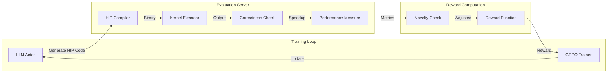

# RL4Kernel

**Reinforcement Learning for HIP Kernel Optimization**

A reinforcement learning training framework for optimizing HIP kernels using Large Language Models, built on [veRL](https://github.com/volcengine/verl) (v0.4.1).

## Table of Contents

[Overview](#overview) | [Architecture](#architecture) | [Project Structure](#project-structure) | [Quick Start](#quick-start) | [Reward Function](#reward-function) | [Configuration](#configuration) | [Evaluation Server](#evaluation-server) | [License](#license)

---

## Overview

RL4Kernel leverages reinforcement learning to train LLMs for generating optimized HIP (Heterogeneous-Compute Interface for Portability) kernels. The system uses GRPO (Group Relative Policy Optimization) to improve kernel code generation through automated compilation, execution, and performance evaluation.

### Key Features

- **GRPO Training**: Group Relative Policy Optimization for efficient RL training
- **Automated Evaluation**: Real-time kernel compilation, correctness verification, and speedup measurement
- **Multiple Training Modes**:
  - `hip2hip`: Optimize existing HIP kernels
  - `kernel2kernel`: Transform kernels across different implementations
- **Distributed Training**: Multi-GPU support with Ray and FSDP
- **Custom Reward Function**: Performance-based scoring with compilation and correctness checks

---

## Architecture



For detailed reward computation flow including layered penalties, linear speedup scaling, and novelty bonus mechanism, see [Reward Flow Documentation](reward/README.md).

---

## Project Structure

```
RL4Kernel/
├── verl/                          # veRL training framework (v0.4.1)
├── reward/                        # Custom reward functions
│   ├── reward.py                  # Legacy single-sample reward path
│   └── reward_batch.py            # Batch reward processing used by current launchers
├── scripts/                       # Training & deployment scripts
│   ├── train/
│   │   ├── react_single_turn_v1.sh
│   │   ├── react_single_turn_v1_hip2hip.sh
│   │   ├── react_multi_turn.sh
│   │   └── HIP2HIP_TRAINING.md
│   └── eval/                      # KernelBench eval wrappers
├── sandbox/                       # Evaluation client adapters
├── HIP_benchmark_kit/             # Benchmark tools & evaluation
│   ├── eval/                      # Evaluation utilities
│   ├── data/                      # Benchmark data
│   └── gen_hip_kernel/            # Kernel generation tools
├── hip_kernel_evaluation_server/  # HIP kernel evaluation server
│   ├── server_req_deploy_hip2hip_batch.py  # Batch evaluation server
│   ├── setup_server_req_deploy_hip2hip_batch.sh  # Startup script
│   └── ...
└── LICENSE                        # Apache 2.0
```

---

## Quick Start

### Prerequisites

- Python 3.10+
- PyTorch 2.0+
- AMD ROCm / HIP runtime
- Ray for distributed training

### Installation

```bash
# Clone the repository
git clone https://github.com/AMD-AGI/rl4kernel_hip.git
cd rl4kernel_hip

# Install veRL and dependencies
pip install -e verl/
pip install ray[default] hydra-core wandb

# Install gunicorn (required for evaluation server)
pip install gunicorn
```

### Data Preprocessing

Before training, prepare the training data in Parquet format. The scripts require `pandas`, `datasets`, and `pyarrow`:

```bash
pip install pandas datasets pyarrow
```

**For hip2hip full-file training:**

```bash
python dataset/convert_to_verl_parquet.py \
  --input-jsons dataset/hip_kernel_rldataset/rl_data_hard.json dataset/hip_kernel_rldataset/rl_data_normal.json \
  --input-format rl_data \
  --reference-root dataset/AIG-Datasets/v0.1/PyTorch_HIP_kernel_dataset/pytorch_hip_kernel_gpumode \
  --data-source hip2hip-train \
  --optimization-paradigm hip2hip \
  --target-gpus mi300x \
  --output-contract sample_json_v1 \
  --output-dir dataset/hip2hip_parquet \
  --output-name rl_data_hard_normal_mixed_hip2hip \
  --shuffle --seed 42
```

**For kernel2kernel splice training:**

```bash
python dataset/convert_to_verl_parquet.py \
  --input-jsons path/to/kernel2kernel_processed.json \
  --input-format kernel2kernel_json \
  --pytorch-root dataset/AIG-Datasets/v0.1/PyTorch_HIP_kernel_dataset/pytorch_hip_kernel_gpumode \
  --hip-opt-dir dataset/AIG-Datasets/v0.1/PyTorch_HIP_kernel_dataset/pytorch_hip_kernel_gpumode/hip_opt \
  --data-source kernel2kernel-train \
  --optimization-paradigm kernel2kernel \
  --target-gpus mi300x \
  --output-contract sample_json_v1 \
  --output-dir dataset/kernel2kernel_parquet \
  --output-name kernel2kernel_mixed
```

The output Parquet files contain:
- `prompt`: Chat-style messages using the shared kernel-agent prompt template
- `data_source`: Dataset identifier
- `ability`: Task type ("kernel_optimization")
- `reward_model`: Ground truth for evaluation (kernel code, tolerances, etc.)
- `extra_info`: Metadata (kernel name, source type, paths)

See [dataset/README.md](dataset/README.md) for the full converter contract and
file naming rules.

---

### Training

**Step 1: Start the Evaluation Server**

Before training, start the HIP kernel evaluation server in a separate terminal:

```bash
cd hip_kernel_evaluation_server
HIP_VISIBLE_DEVICES=0,1,2,3,4,5,6,7 ./setup_server_req_deploy_hip2hip_batch.sh
```

**Step 2: Run Training**

All current launchers expect `WANDB_API_KEY` to be supplied by the environment;
do not put keys in scripts or tracked config files.

Hip2Hip single-turn full-file optimization:

```bash
export WANDB_API_KEY=...
bash scripts/train/react_single_turn_v1_hip2hip.sh \
  --train dataset/hip2hip_parquet/train.parquet \
  --val dataset/hip2hip_parquet/val.parquet \
  --sf-url http://host:8080/run_code
```

Kernel2Kernel single-turn splice optimization:

```bash
export WANDB_API_KEY=...
bash scripts/train/react_single_turn_v1.sh \
  --train dataset/kernel2kernel_parquet/train.parquet \
  --val dataset/kernel2kernel_parquet/val.parquet \
  --sf-url http://host:8080/run_code
```

Multi-turn tool-use training:

```bash
export WANDB_API_KEY=...
bash scripts/train/react_multi_turn.sh \
  --train path/to/train.parquet \
  --val path/to/val.parquet \
  --sf-url http://reward-server:8080/run_code \
  --tool-server-url http://tool-server:8080
```

---

## Training Modes

`react mode` is the current response contract, not a synonym for multi-turn. It
uses `sample_json_v1`, where the assistant returns one JSON object with
`thought` and `code`. The `code` value is either a complete `.hip` translation
unit for hip2hip or a kernel function for kernel2kernel.

`normal` or legacy mode refers to `legacy_hip_fence_v1`, where the model returns
HIP code inside markdown fences. It is kept for compatibility and legacy
experiments, but new training data should use `sample_json_v1`.

`single-turn` and `multi-turn` describe the rollout shape. Single-turn launchers
generate one assistant response and score it. `react_multi_turn.sh` enables async
rollout plus tool calls through `scripts/train/tool_config/hip_kernel_eval_tool_config.yaml`.

| Goal | Contract | Launcher |
|------|----------|----------|
| Hip2Hip full-file single-turn | `sample_json_v1` | `scripts/train/react_single_turn_v1_hip2hip.sh` |
| Kernel2Kernel splice single-turn | `sample_json_v1` | `scripts/train/react_single_turn_v1.sh` |
| Multi-turn tool-use | `sample_json_v1` | `scripts/train/react_multi_turn.sh` |
| Legacy fenced HIP | `legacy_hip_fence_v1` | `scripts/train/legacy/` |

## Reward Function

Current training scripts use `reward/reward_batch.py` through the batch reward
manager. The production default is:

```bash
REWARD_MODE="correct_speedup_copy_penalty"
```

This mode gives `0.0` for compile, run, match, and parse failures. Correct
non-copy kernels receive `r_ok + clipped_speedup + optional_bonus`; near-copy
kernels receive `REWARD_CORRECT_SPEEDUP_COPY_REWARD`.

`REWARD_MODE="soft_clip_novelty"` is an alternative with negative compile/run/
match gates and DTW novelty shaping. The legacy default scorer remains for
compatibility only. See [reward/README.md](reward/README.md) for the mode table
and formulas.

---

## Configuration

Training configurations are managed via Hydra. Key parameters:

```yaml
# Model
actor_rollout_ref.model.path: "path/to/base/model"

# Training
trainer.total_epochs: 100
trainer.save_freq: 10

# Reward
custom_reward_function.path: "reward/reward.py"
custom_reward_function.name: "compute_score"
```

---

## Evaluation Server

The evaluation server provides real-time HIP kernel compilation, execution, and performance measurement. It supports batch parallel evaluation across multiple GPUs.

### Starting the Server

```bash
cd hip_kernel_evaluation_server
./setup_server_req_deploy_hip2hip_batch.sh
```

The server will start on port 8080 by default, using all available GPUs (0-7).

### Environment Variables

| Variable | Default | Description |
|----------|---------|-------------|
| `HIP_VISIBLE_DEVICES` | `0,1,2,3,4,5,6,7` | Comma-separated GPU IDs to use |
| `HIP_PERF_ITERATIONS` | `100` | Number of iterations for performance measurement |
| `HIP_ERROR_LOG_DIR` | `./error_log` | Directory for error logs |
| `HCC_AMDGPU_TARGET` | `gfx942` | Target GPU architecture |

### API Endpoints

| Endpoint | Method | Description |
|----------|--------|-------------|
| `/run_code_batch` | POST | Batch evaluate multiple kernels in parallel |
| `/run_code` | POST | Evaluate a single kernel (compatibility) |
| `/health` | GET | Health check |

### Example Request

```python
import requests

response = requests.post("http://localhost:8080/run_code_batch", json={
    "requests": [
        {
            "kernel_name": "my_kernel",
            "hip_code": "...",           # Generated HIP kernel code
            "hip_ref_code": "...",       # Reference HIP kernel code
            "pytorch_module_code": "",
            "pytorch_functional_code": "...",  # PyTorch test code
            "atol": 1e-4,
            "rtol": 1e-3
        }
    ]
})
```

### Multi-Node Deployment

For large-scale training, deploy both the evaluation server and Ray training cluster across multiple nodes.

#### Multi-Node Evaluation Server

The evaluation server supports distributed deployment for ~6.5x speedup with 11 nodes (88 GPUs).

**Step 1: Configure workers** (`hip_kernel_evaluation_server/workers.yaml`):

```yaml
master:
  gpus: [0, 1, 2, 3, 4, 5, 6, 7]

workers:
  - host: "10.254.6.41"
    port: 8080
    gpus: 8
  - host: "10.254.6.42"
    port: 8080
    gpus: 8
```

**Step 2: Start worker nodes** (on each worker):

```bash
cd hip_kernel_evaluation_server
./setup_worker.sh
```

**Step 3: Start master node**:

```bash
./setup_master.sh --config workers.yaml
```

For detailed architecture and troubleshooting, see [MULTI_NODE_README.md](hip_kernel_evaluation_server/MULTI_NODE_README.md).

#### Multi-Node Ray Training Cluster

**Step 1: Start Ray head node** (on master, e.g., `10.254.6.41`):

```bash
cd scripts/ray
./ray_head.sh
```

This starts Ray head with dashboard at `http://<head_ip>:8265`.

**Step 2: Start Ray worker nodes** (on each worker):

```bash
cd scripts/ray
# Edit ray_worker.sh to set correct --address and --node-ip-address
./ray_worker.sh
```

**Step 3: Verify cluster**:

```bash
ray status
# Should show all nodes and GPUs
```

**Step 4: Run distributed training**:

```bash
# Training script auto-detects Ray cluster
export WANDB_API_KEY=...
bash scripts/train/react_single_turn_v1.sh \
  --train path/to/train.parquet \
  --val path/to/val.parquet \
  --sf-url http://reward-server:8080/run_code
```

**Key environment variables** (set in ray scripts):

| Variable | Purpose |
|----------|---------|
| `RAY_EXPERIMENTAL_NOSET_HIP_VISIBLE_DEVICES=1` | Preserve HIP device visibility |
| `RAY_EXPERIMENTAL_NOSET_ROCR_VISIBLE_DEVICES=1` | Preserve ROCr device visibility |
| `VLLM_ATTENTION_BACKEND=XFORMERS` | Use XFormers attention backend |

**Port requirements**: Ensure ports 6379, 8265, 10002-19999 are open between nodes.

---

## License

This project is licensed under the Apache License 2.0 - see the [LICENSE](LICENSE) file for details.

---

## Acknowledgments

- [veRL](https://github.com/volcengine/verl) - Volcano Engine Reinforcement Learning for LLMs
- AMD ROCm Team for HIP runtime support
