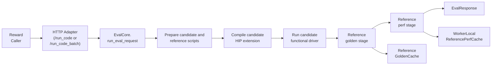
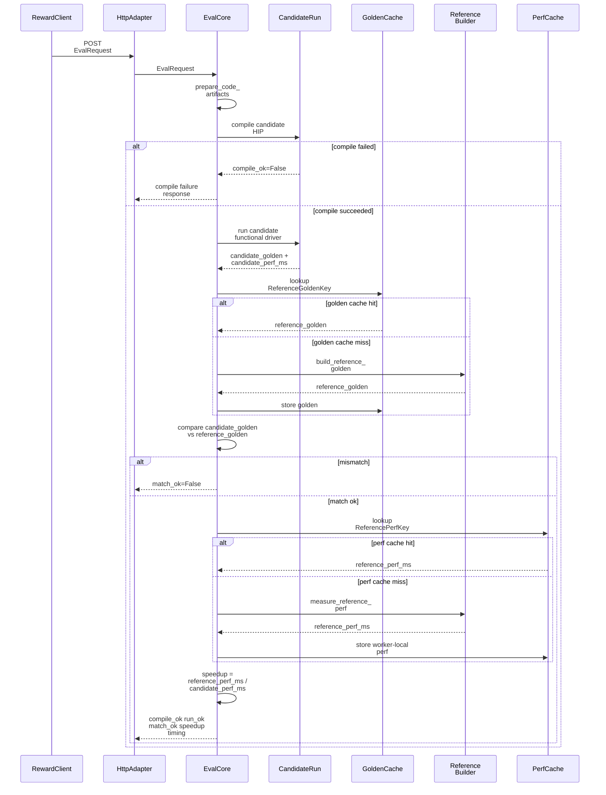
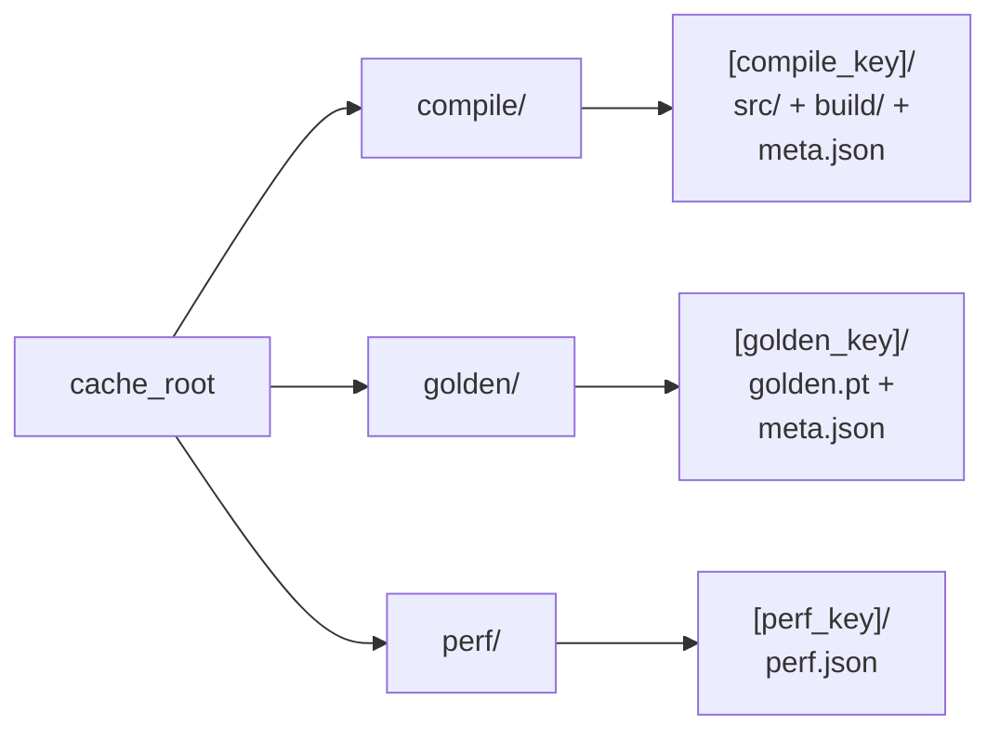
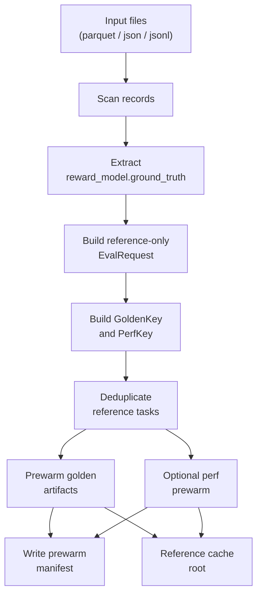
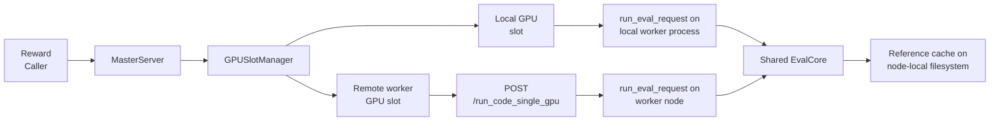
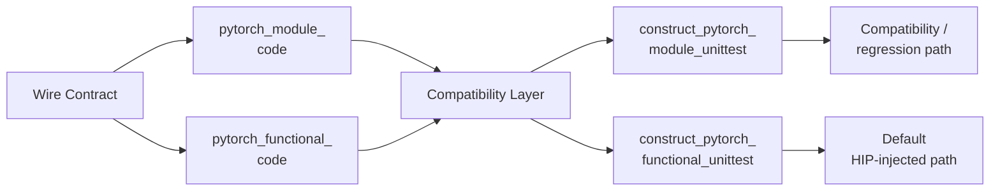

# HIP Kernel Evaluation Sandbox

This package hosts the reward sandbox server used by training and evaluation flows to compile, run, validate, and benchmark HIP kernels against a reference implementation.

The current design has four main goals:

- preserve the existing request/response contract used by reward code
- preserve `pytorch_module_code` and `pytorch_functional_code` wire compatibility
- separate correctness from performance baseline handling
- improve throughput with a layered reference cache stack: golden first, compile artifact second, perf last

Implementation note:

- reference compile, correctness, and perf are logically separated
- when both reference artifacts are cold, the runtime may still use one combined reference execution to avoid redundant cold-path work, then materialize the logical `golden` and `perf` artifacts separately
- benchmarked warm-cache wins should not be described as current training wins unless the serving deployment actually has the corresponding cache flags enabled

## Module Map

| Module | Responsibility |
|---|---|
| `sandbox_core/` | Core evaluation logic, config, protocol, runtime helpers, cache helpers |
| `server_adapters/` | FastAPI adapters for single-node, worker-node, and master-node entrypoints |
| `server_compat/` | Compatibility shims for legacy `hip_kernel_check_utils_*` imports |
| `server_tools/` | Prewarm and real-validation utilities |
| `sandbox_tests/` | Package-local smoke/unit tests |
| root wrapper modules | Backward-compatible import and gunicorn entrypoints |

## Local Sandbox Dependencies

For the local HIP sandbox server, install the Python web/runtime layer with:

```bash
python -m pip install -r hip_kernel_evaluation_server/requirements-local-sandbox.txt
```

The requirements file intentionally pins `fastapi==0.115.12` with
`starlette==0.46.2`. Do not use Starlette 1.x with this FastAPI line; the server
will fail while constructing `FastAPI` / `APIRouter`.

This file assumes the base image already provides ROCm, `hipcc`, and
ROCm-enabled PyTorch.

## Directory Layout

```text
hip_kernel_evaluation_server/
├── sandbox_core/
│   ├── protocol.py
│   ├── config.py
│   ├── result.py
│   ├── codegen.py
│   ├── runtime.py
│   ├── reference.py
│   ├── parallel.py
│   ├── eval.py
│   ├── cache.py
│   ├── loader_template.py
│   ├── unittest_templates.py
│   ├── safe_call_helper.py
│   └── fix_seed.py
├── server_adapters/
│   ├── single.py
│   ├── worker.py
│   └── master.py
├── server_compat/
│   ├── hip2hip.py
│   └── hip2hip_parallel.py
├── server_tools/
│   ├── prewarm_reference_cache.py
│   ├── real_smoke_validation.py
│   ├── test_cluster.py
│   ├── cross_node_server_test.py
│   └── view_errors.sh
├── sandbox_tests/
│   ├── test_reference_cache.py
│   └── test_server_contracts.py
├── docs/
│   ├── REFERENCE_CACHE.md
│   ├── VALIDATION_RESULTS.md
│   ├── MULTI_NODE_README.md
│   ├── ERROR_LOG_README.md
│   └── ERROR_LOG_CONFIG.md
├── runtime/
│   └── README.md
├── README.md
└── root compatibility wrappers, entrypoints, and startup scripts
```

## Online Evaluation Flow



### Detailed Online Pipeline



## Reference Cache Design

The reference cache stack is intentionally split into three layers.

- `reference_compile_artifact` is build-oriented and reuses a compiled reference HIP extension under a stable reference identity.
- `reference_golden` is correctness-oriented and should preserve semantics when the key matches.
- `reference_perf` is speedup-oriented and must be more conservative because stale or cross-node values can pollute reward quality.

```mermaid
graph TB
    RefIdentity["Reference Identity"] --> CompileKey["Reference<br/>CompileArtifactKey"]
    RefIdentity --> GoldenKey["Reference<br/>GoldenKey"]
    RefIdentity --> PerfKey["Reference<br/>PerfKey"]

    CompileKey --> CK1["hip_ref_code hash"]
    CompileKey --> CK2["pytorch_functional_<br/>code hash"]
    CompileKey --> CK3["pytorch_module_<br/>code hash<br/>(if used)"]
    CompileKey --> CK4["template_bundle<br/>hash"]
    CompileKey --> CK5["effective_arch"]
    CompileKey --> CK6["compiler / software<br/>identity"]
    CompileKey --> CK7["cache_schema_<br/>version"]

    GoldenKey --> GK1["hip_ref_code hash"]
    GoldenKey --> GK2["pytorch_functional_<br/>code hash"]
    GoldenKey --> GK3["pytorch_module_<br/>code hash<br/>(only if used)"]
    GoldenKey --> GK4["template_bundle<br/>hash"]
    GoldenKey --> GK5["effective_arch"]
    GoldenKey --> GK6["software stack<br/>fingerprint"]
    GoldenKey --> GK7["cache_schema_<br/>version"]

    PerfKey --> PK0["all GoldenKey<br/>fields"]
    PerfKey --> PK1["perf_<br/>iterations"]
    PerfKey --> PK2["runtime_<br/>fingerprint"]
    PerfKey --> PK3["worker hostname<br/>or node_id"]
    PerfKey --> PK4["cache_schema_<br/>version"]

```



### Cache Layout



## Prewarm Flow

`server_tools/prewarm_reference_cache.py` supports two modes:

- `--golden-only` by default
- `--with-perf` only when the serving workers are sufficiently homogeneous and the prewarm command uses an explicit `--gpu-id`



## Multi-Node Execution Flow



## Module And Functional Compatibility

The sandbox still accepts both `pytorch_module_code` and `pytorch_functional_code` in requests and datasets.

- `functional` remains the default hot path for injected HIP execution.
- `module` remains part of the interface contract and builder compatibility layer.
- adapters and shims should not silently delete either field from the wire contract.



## Key Runtime Controls

Important environment variables are resolved via `eval_config.load_eval_settings()`:

| Variable | Meaning |
|---|---|
| `HIP_VISIBLE_DEVICES` | GPU id list used by the current server |
| `HIP_EVAL_ARCH` / `HCC_AMDGPU_TARGET` | effective arch for generated loader scripts |
| `HIP_PERF_ITERATIONS` | benchmark loop count |
| `HIP_COMPILE_TIMEOUT_S` | compile timeout |
| `HIP_RUN_TIMEOUT_S` | runtime timeout |
| `HIP_REFERENCE_CACHE_DIR` | cache root |
| `HIP_ENABLE_REF_COMPILE_CACHE` | enable persistent reference compile artifact reuse |
| `HIP_ENABLE_REF_GOLDEN_CACHE` | enable correctness-preserving golden cache |
| `HIP_ENABLE_REF_PERF_CACHE` | enable conservative worker-local perf cache |
| `HIP_REF_PERF_CACHE_TTL_S` | perf cache TTL, defaulting to a non-zero lifetime |
| `HIP_CLEANUP_TMP_ON_SUCCESS` | cleanup temp dirs on success |
| `HIP_RETAIN_TMP_ON_FAILURE` | retain temp dirs on failure |

## Design Principles

1. Keep public API compatibility first.
2. Prefer `reference_compile_artifact` and `reference_golden` reuse before broader `reference_perf` reuse.
3. Treat `reference_perf` as a conservative optimization guarded by runtime fingerprinting, TTL, and provenance.
4. Keep server adapters thin and push evaluation semantics into the shared core.
5. Prefer node-local cache correctness over aggressive cluster-wide reuse.

## Related Docs

- [docs/MULTI_NODE_README.md](docs/MULTI_NODE_README.md)
- [docs/ERROR_LOG_README.md](docs/ERROR_LOG_README.md)
- [docs/ERROR_LOG_CONFIG.md](docs/ERROR_LOG_CONFIG.md)
- [docs/REFERENCE_CACHE.md](docs/REFERENCE_CACHE.md)
- [docs/VALIDATION_RESULTS.md](docs/VALIDATION_RESULTS.md)
- [server_tools/prewarm_reference_cache.py](server_tools/prewarm_reference_cache.py)
- [server_tools/real_smoke_validation.py](server_tools/real_smoke_validation.py)
