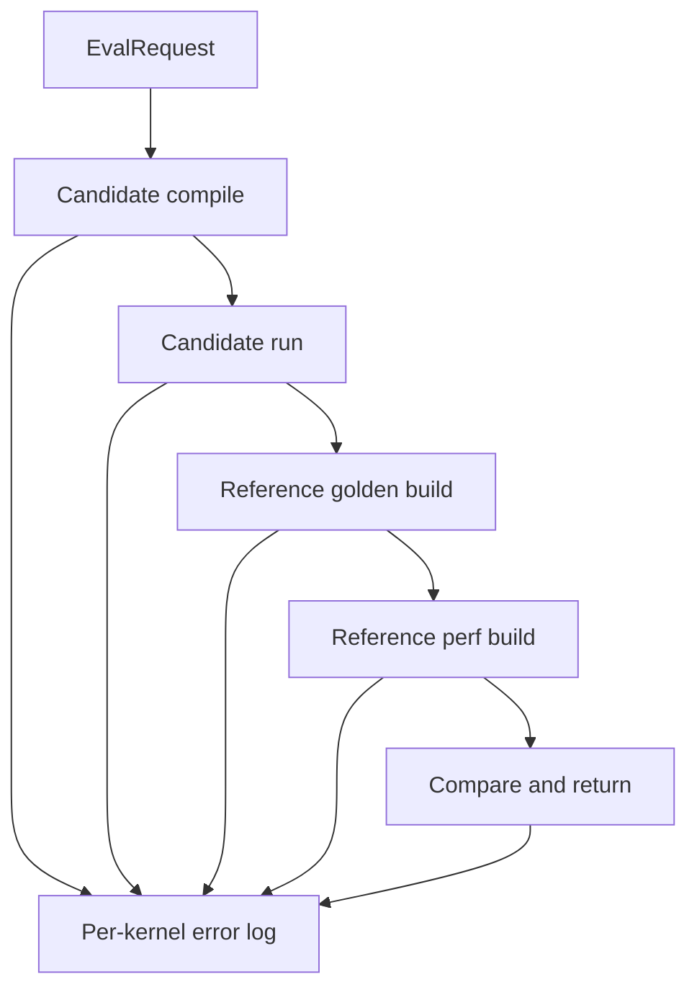

# Error Logging In The HIP Evaluation Sandbox

The source of truth for error logging now lives in `eval_core.py` via `log_error`-style helpers used by:
- candidate compilation
- candidate execution
- reference golden build
- reference perf measurement
- prewarm reference materialization

## Default Log Location

Server adapters normally pass an explicit per-kernel log path under `HIP_ERROR_LOG_DIR`:

```text
{HIP_ERROR_LOG_DIR}/
  kernel_a_error.log
  kernel_b_error.log
  kernel_c_error.log
```

If an explicit error-log path is not provided, the evaluation core falls back to:

```text
{tmp_dir}/error_log.txt
```

## Logged Stage Names

The current implementation emits stage names derived from the actual execution stage:

| Stage | Meaning |
|---|---|
| `COMPILATION_TIMEOUT` / `COMPILATION_FAILED` | candidate compile step failed |
| `TEST_RUN_TIMEOUT` / `TEST_RUN_FAILED` | candidate execution step failed |
| `REF_GOLDEN_RUN_TIMEOUT` / `REF_GOLDEN_RUN_FAILED` | online reference golden build failed |
| `REF_PERF_RUN_TIMEOUT` / `REF_PERF_RUN_FAILED` | online reference perf measurement failed |
| `REF_GOLDEN_PREWARM_TIMEOUT` / `REF_GOLDEN_PREWARM_FAILED` | offline golden prewarm failed |
| `REF_PERF_PREWARM_TIMEOUT` / `REF_PERF_PREWARM_FAILED` | offline perf prewarm failed |
| `RESULT_MISMATCH` | candidate output differs from cached or freshly built reference golden |
| `EXCEPTION` | unexpected Python-side exception |

## Error Logging Flow



## Log Record Format

Each error record contains:
- timestamp
- kernel name
- stage name
- human-readable message
- stderr or traceback when available

Example shape:

```text
================================================================================
[2026-03-25 15:00:00] Kernel: my_kernel | Stage: TEST_RUN_FAILED
--------------------------------------------------------------------------------
[ERROR] TEST_RUN failed for my_kernel

Stderr Output:
...
================================================================================
```

## Operational Notes

- write failures inside the logger are swallowed so they do not crash the main evaluation path
- temp-dir cleanup and cache cleanup are separate concerns; deleting temp dirs does not remove cache artifacts
- prewarm failures use dedicated `*_prewarm_error.log` files when invoked through `server_tools/prewarm_reference_cache.py`

## Related Docs

- [../README.md](../README.md)
- [REFERENCE_CACHE.md](REFERENCE_CACHE.md)
- [ERROR_LOG_CONFIG.md](ERROR_LOG_CONFIG.md)
