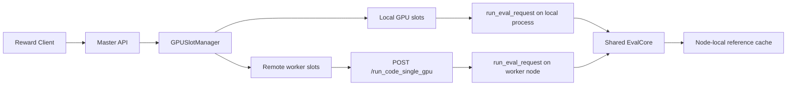
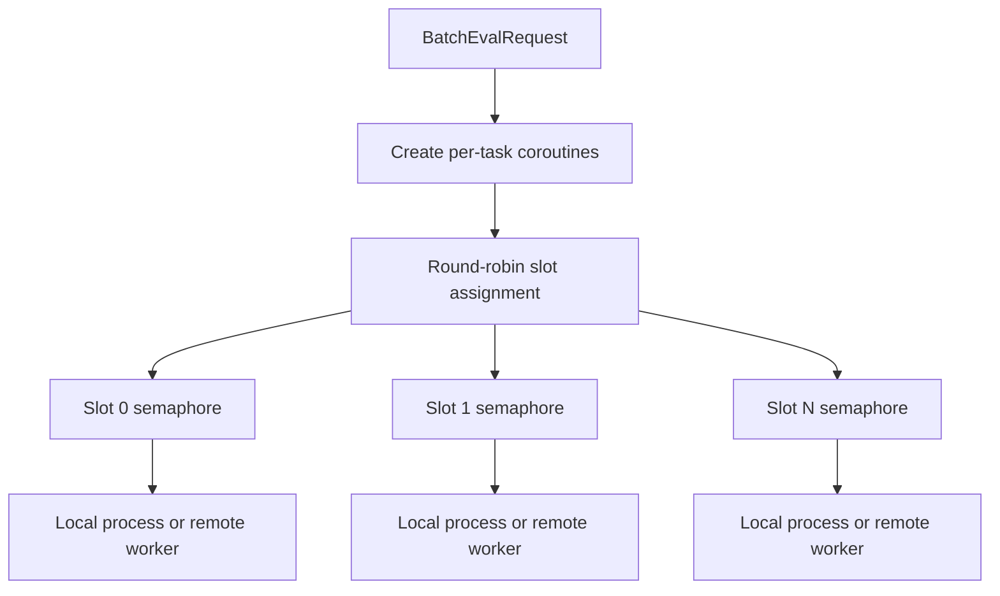
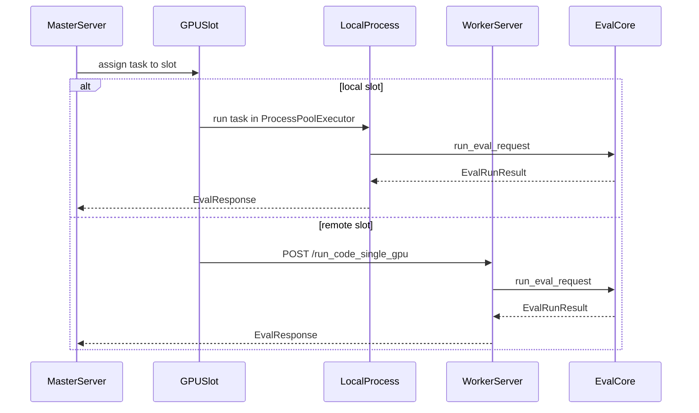

# Multi-Node HIP Kernel Evaluation Server

This document describes the distributed deployment model built around:
- `master_server.py`
- `server_req_deploy_hip2hip_batch.py`
- `eval_core.py`

For the full package design, see [../README.md](../README.md).

## Runtime Topology



## Dispatch Model

The master does not maintain a separate explicit queue object. Instead it:
- receives `BatchEvalRequest`
- creates one coroutine per task
- assigns each task to a `GPUSlot` using round-robin selection
- relies on a per-slot `asyncio.Semaphore(1)` so each GPU remains exclusive while a kernel is being evaluated



This preserves a simple scheduling model while keeping the actual evaluation logic centralized in `eval_core.py`.

## Endpoint Roles

### Master endpoints

| Endpoint | Method | Role |
|---|---|---|
| `/health` | GET | master health and slot summary |
| `/cluster/status` | GET | worker health and cluster availability |
| `/run_code_batch` | POST | distribute a batch across local and remote slots |
| `/run_code` | POST | compatibility wrapper over single-item batch |

### Worker endpoints

| Endpoint | Method | Role |
|---|---|---|
| `/health` | GET | worker health |
| `/worker/info` | GET | worker metadata |
| `/run_code_single_gpu` | POST | evaluate a single task on a specific visible GPU |
| `/run_code_batch` | POST | evaluate a local batch directly on a worker |
| `/run_code` | POST | compatibility single-task endpoint |

## Local vs Remote Execution



## Cache Locality

The reference cache is node-local by default.

Implications:
- local slots and remote workers do not automatically share cache entries unless the cache directory is placed on shared storage
- `reference_golden` hits remain safe as long as the key matches the same reference execution identity
- `reference_perf` is intentionally conservative and should be treated as worker-local or node-local first

## Configuration Sources

Cluster behavior comes from two layers:
- `workers.yaml` for master/worker topology and request timeout policy
- `eval_config.load_eval_settings()` for runtime knobs such as cache, timeouts, arch, and perf iterations

Important runtime env vars include:
- `HIP_ENABLE_REF_COMPILE_CACHE`
- `HIP_VISIBLE_DEVICES`
- `HIP_EVAL_ARCH`
- `HIP_PERF_ITERATIONS`
- `HIP_COMPILE_TIMEOUT_S`
- `HIP_RUN_TIMEOUT_S`
- `HIP_REFERENCE_CACHE_DIR`
- `HIP_ENABLE_REF_GOLDEN_CACHE`
- `HIP_ENABLE_REF_PERF_CACHE`
- `HIP_REF_PERF_CACHE_TTL_S`

## File Map

```text
hip_kernel_evaluation_server/
├── sandbox_core/              # shared runtime/config/cache/eval logic
├── server_adapters/           # single/worker/master FastAPI adapters
├── server_compat/             # legacy wrapper imports
├── server_tools/              # prewarm and validation utilities
├── sandbox_tests/             # smoke/unit tests
├── README.md
├── REFERENCE_CACHE.md
├── VALIDATION_RESULTS.md
├── MULTI_NODE_README.md
└── root compatibility wrappers + startup scripts
```
