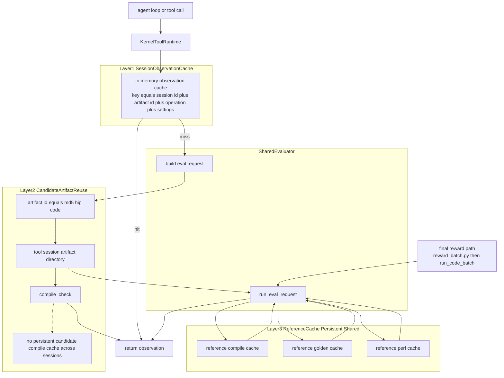
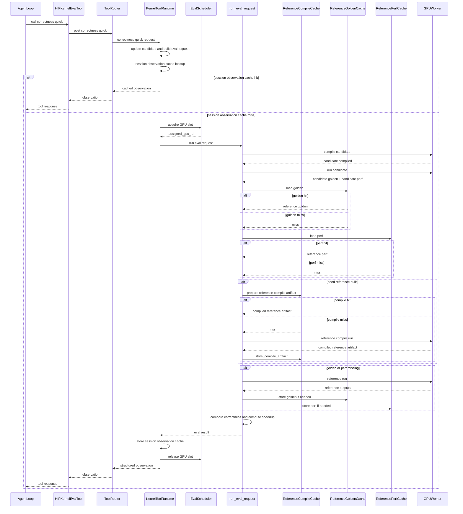

# Multi-turn Agentic RL Architecture

This note condenses the current multi-turn agentic RL build into one place:

1. the current local architecture and request pipeline
2. the upstream `verl` v0.7 positioning that changes how this branch should be interpreted
3. the two cache strategy views that matter operationally
4. the practical conclusions about what is already cached, what is still missing, and which parts are stopgaps rather than final architecture

## One-Sentence Summary

The current build does **not** turn the old reward server into a chat-aware agent runtime. It does something more specific:

- it adds a real rollout-time tool path for intermediate observations
- it adds explicit evaluation scheduling for scarce CPU/GPU evaluation resources
- it keeps the original final reward path as the terminal scoring source of truth
- but it still hosts all of that inside a `legacy single_controller + WorkerDict + trainer-side async manager` boundary

That last point matters. Upstream `verl` v0.7 has already moved the architectural center of gravity toward `rollout server mode + AgentLoop`, so this branch should treat its current async vLLM sidecar path as a necessary stopgap, not as the long-term target shape.

## Core Design Boundary

- `tool path`: used during rollout for `compile_check`, `correctness_quick`, `profile_quick`, and diagnostics
- `final reward path`: used after the final candidate is produced, via `reward/reward_batch.py -> /run_code_batch`
- `shared sandbox core`: both paths reuse the same evaluator core, reference cache logic, and compilation pipeline

This preserves reward semantics while enabling multi-turn tool use.

## Positioning Against Upstream v0.7

The decisive insight from upstream is not an API detail. It is an architectural judgment.

Official sources:

- [verl 0.7 release blog](https://verl.readthedocs.io/en/latest/blog/v0.7.html)
- [Recipe: Fully Async Policy Trainer](https://verl.readthedocs.io/en/latest/advance/fully_async.html)
- [The Design of `verl.single_controller`](https://verl.readthedocs.io/en/latest/single_controller.html)
- [release/v0.7.0 `vllm_async_server.py`](https://raw.githubusercontent.com/volcengine/verl/release/v0.7.0/verl/workers/rollout/vllm_rollout/vllm_async_server.py)

| Upstream signal | What it says | Why it matters for this branch |
|---|---|---|
| `verl` v0.7 rollout engine | v0.7 removes legacy SPMD rollout and switches to rollout server mode by default. | Multi-turn agentic rollout is no longer framed as a patch on old batch rollout. It is treated as a serving problem. |
| `AgentLoop` introduction | Upstream adds `AgentLoopBase`, `SingleTurnAgentLoop`, and `ToolAgentLoop`. | Multi-turn and tool-calling are given a first-class client abstraction instead of being hidden inside ad hoc trainer logic. |
| fully async design | The first design point is `Resource Isolation`, and `vllm` must use server mode based on `AgentLoop`. | Trainer is supposed to be control-plane, while rollouter/server is the serving-plane. A CPU actor should not be guessing rollout worker GPU semantics. |
| v0.8 roadmap | Upstream explicitly plans to separate the vLLM worker from the trainer process and update weights via CUDA IPC. | Even a clean short-term fix on this branch is still a stopgap. Upstream is already preparing to split the trainer-side boundary more aggressively. |

The blunt conclusion is:

- upstream is telling us that multi-turn agentic rollout should be an independent rollout server system
- this branch is still trying to host that new system inside a legacy trainer-side async patch
- therefore the current worker-brokered sidecar spawn is the right short-term fix, but it should not be confused with the end state

## Upstream vs Current Local Shape

| Concern | Upstream release/v0.7.0 shape | Current local branch | Practical consequence |
|---|---|---|---|
| Rollout entrypoint | `vLLMReplica` launches server actors and owns worker handles explicitly. | `RayPPOTrainer` still constructs `AsyncLLMServerManager`, then drives `wake_up() -> generate_sequences() -> sleep()`. | Trainer still owns too much of the serving lifecycle. |
| Server and worker binding | `vLLMHttpServerBase` receives `workers: list[ActorHandle]`. | `AsyncvLLMServer` rediscovers actors indirectly through `ExternalRayDistributedExecutor` and `WorkerDict` actor naming. | Binding is weaker, more implicit, and more brittle. |
| GPU runtime provenance | Server launch is node-local and worker-linked as part of replica construction. | `Worker.spawn_colocated_async_server()` copies `CUDA_VISIBLE_DEVICES` into a CPU sidecar runtime. | This is the correct stopgap, but still not a native replica object that owns worker handles directly. |
| Multi-turn client logic | `AgentLoop` is a first-class abstraction. | `ChatCompletionScheduler` and `ToolCompletionCallback` live in a trainer-side thread and callback stack. | The branch has the behavior, but not yet the cleaner abstraction boundary. |
| Resource boundary | Fully async docs emphasize separate Trainer and Rollouter resources. | Async rollout still overlays on `actor_rollout_wg` plus a sidecar bridge. | Resource semantics are clearer than before, but the serving-plane is not yet independently modeled. |
| Migration direction | v0.8/v0.9 roadmap keeps pushing toward more server/replica separation and removal of legacy engines. | Current branch is still repairing a legacy `single_controller` async seam. | Short-term fixes are valid, but they accumulate debt if treated as the final architecture. |

## Key Files

| Layer | Key files | Responsibility |
|---|---|---|
| Data / launch | `scripts/train/react_multi_turn.sh`, `dataset/multi_turn_tools.py`, `dataset/add_multiturn_agentic_fields.py`, `verl/verl/utils/dataset/rl_dataset.py` | Enable async multi-turn rollout and inject per-sample tool context |
| Trainer / orchestration | `verl/verl/trainer/ppo/ray_trainer.py`, `verl/verl/workers/rollout/async_server.py`, `verl/verl/workers/fsdp_workers.py` | Build `actor_rollout_wg`, switch async path on, and route generation through `AsyncLLMServerManager` instead of the old `generate_sequences()` worker call |
| Rollout serving bridge | `verl/verl/single_controller/base/worker.py`, `verl/verl/workers/rollout/vllm_rollout/vllm_async_server.py`, `verl/verl/single_controller/ray/base.py` | Spawn the sidecar from a rollout worker, export GPU visibility into the sidecar runtime, and bridge the sidecar back into `WorkerDict` actors |
| Multi-turn client loop | `verl/verl/workers/rollout/chat_scheduler.py`, `verl/verl/tools/hip_kernel_eval_tool.py` | Request-scoped tool lifecycle, chat resubmission, and rollout-time tool invocation |
| Tool server | `hip_kernel_evaluation_server/server_adapters/tool_router.py`, `hip_kernel_evaluation_server/sandbox_core/tool_runtime.py`, `hip_kernel_evaluation_server/sandbox_core/tool_protocol.py` | Session management, eval scheduling, tool endpoints |
| Shared evaluator | `hip_kernel_evaluation_server/sandbox_core/eval.py`, `hip_kernel_evaluation_server/sandbox_core/reference.py`, `hip_kernel_evaluation_server/sandbox_core/cache.py` | Candidate/reference evaluation and reference-side cache reuse |
| Final reward | `reward/reward_batch.py`, `verl/verl/workers/reward_manager/batch_parallel.py` | End-of-trajectory scoring |

## Current Local Control/Data Flow

This is the most important local diagram because it makes the legacy boundary visible.

```mermaid
flowchart LR
    subgraph entry [EntryAndTrainer]
        TrainScript["react_multi_turn.sh"]
        Dataset["RLHFDataset"]
        Trainer["RayPPOTrainer"]
        AsyncMgr["AsyncLLMServerManager"]
        Scheduler["ChatCompletionScheduler"]
    end

    subgraph bridge [LegacyAsyncBridge]
        Spawn["Worker.spawn_colocated_async_server"]
        Sidecar["AsyncvLLMServer (CPU actor)"]
        Executor["ExternalRayDistributedExecutor"]
        WorkerDict["WorkerDict / AsyncActorRolloutRefWorker"]
    end

    subgraph tools [ToolPath]
        ToolClient["HIPKernelEvalTool"]
        ToolRouter["tool_router"]
        ToolRuntime["KernelToolRuntime"]
        EvalScheduler["EvalScheduler"]
        EvalCore["run_compile_request / run_eval_request"]
        RefCache["reference caches"]
    end

    subgraph reward [FinalReward]
        RewardBatch["reward_batch.py"]
        RunCodeBatch["run_code_batch"]
    end

    TrainScript --> Dataset
    Dataset --> Trainer
    Trainer --> AsyncMgr
    AsyncMgr --> Spawn
    Spawn --> Sidecar
    AsyncMgr --> Scheduler
    Scheduler -->|"HTTP /v1/chat/completions"| Sidecar
    Sidecar --> Executor
    Executor --> WorkerDict

    Scheduler -->|"tool call callback"| ToolClient
    ToolClient --> ToolRouter
    ToolRouter --> ToolRuntime
    ToolRuntime --> EvalScheduler
    EvalScheduler --> EvalCore
    EvalCore --> RefCache

    Scheduler --> RewardBatch
    RewardBatch --> RunCodeBatch
    RunCodeBatch --> EvalCore
```

## Where The Local Shape Is Still Legacy

- `RayPPOTrainer` still owns async rollout lifecycle. That means the trainer still creates the serving manager and still brackets generation with `wake_up()` and `sleep()`.
- `AsyncActorRolloutRefWorker.generate_sequences()` is intentionally disabled on the async path, so the branch is no longer using the old direct rollout call. But it still re-enters the rollout workers indirectly through `ExternalRayDistributedExecutor`.
- `AsyncvLLMServer` is still a CPU sidecar actor rather than an explicit server/replica object that owns rollout workers directly.
- `ExternalRayDistributedExecutor` still discovers GPU actors by `WorkerDict` actor naming. That ties the path to a deprecated actor factory and makes the contract more fragile than upstream `workers: list[ActorHandle]`.
- `ChatCompletionScheduler` plus `ToolCompletionCallback` are functionally acting like a local `AgentLoop`, but the abstraction boundary is still trainer-thread scheduler code rather than a first-class rollout client abstraction.
- The tool server is already a real external serving boundary. The rollout serving layer is not there yet. That asymmetry explains why tool-use semantics are cleaner than rollout-server semantics on this branch.

## Tool And Reward Data Path

```mermaid
flowchart LR
    subgraph data [DataAndEntry]
        TrainScript["react_multi_turn.sh"]
        ToolsKw["tools kwargs builder"]
        AgenticExport["agentic parquet export"]
        Dataset["RLHFDataset"]
    end

    subgraph rollout [Rollout]
        AsyncMode["async rollout mode"]
        Scheduler["ChatScheduler"]
        ToolClient["HIPKernelEvalTool"]
        RequestScope["request scoped tool lifecycle"]
    end

    subgraph toolserver [ToolServer]
        Router["tool routes"]
        Runtime["KernelToolRuntime"]
        EvalScheduler["EvalScheduler"]
        Session["session id and artifact id"]
    end

    subgraph shared [SharedSandboxCore]
        EvalCore["run compile or eval"]
        RefCache["reference compile golden perf cache"]
    end

    subgraph reward [FinalReward]
        RewardBatch["reward_batch.py"]
        BatchManager["batch_parallel"]
        RunCodeBatch["run code batch"]
    end

    TrainScript --> Dataset
    ToolsKw --> Dataset
    AgenticExport --> Dataset

    Dataset --> AsyncMode
    AsyncMode --> Scheduler
    Scheduler --> RequestScope
    RequestScope --> ToolClient

    ToolClient --> Router
    Router --> Runtime
    Runtime --> Session
    Runtime --> EvalScheduler
    EvalScheduler --> EvalCore
    EvalCore --> RefCache

    Scheduler --> RewardBatch
    RewardBatch --> BatchManager
    BatchManager --> RunCodeBatch
    RunCodeBatch --> EvalCore
```

## Request Pipeline

1. `RayPPOTrainer` routes rollout generation into `AsyncLLMServerManager` when `actor_rollout_ref.rollout.mode=async`.
2. The dataset layer provides `raw_prompt`, `reward_model`, `extra_info`, and optional `tools_kwargs`.
3. `chat_scheduler.py` treats each rollout request as one logical tool session and sends OpenAI-compatible chat requests to `AsyncvLLMServer`.
4. `AsyncvLLMServer` forwards execution into GPU rollout workers through `ExternalRayDistributedExecutor`, which bridges back to `WorkerDict` / `AsyncActorRolloutRefWorker`.
5. When the model emits tool calls, `HIPKernelEvalTool` calls `/tool/*` APIs on the FastAPI tool server.
6. `tool_runtime.py` manages `session_id`, `artifact_id`, budget checks, and explicit CPU/GPU scheduling.
7. `correctness_quick` and `profile_quick` reuse the same `run_eval_request()` path as final evaluation, so reference cache semantics stay aligned.
8. The final candidate still flows through `reward_batch.py -> /run_code_batch`, which remains the terminal truth path.

## Long-Tail And Resource Control

- Multi-turn tool calls do not directly race for GPU execution. They pass through `EvalScheduler`.
- `compile_check` is treated as a CPU-side cheap path.
- `correctness_quick` and `profile_quick` are GPU-side paths with queueing and per-GPU concurrency control.
- Request budgets are enforced through `max_tool_calls` and `max_tool_wallclock_s`.
- The design reduces repeated per-turn global synchronization, but on-policy weight update still retains the final batch barrier.

---

## Cache Strategy I: Three-Layer Relationship

This view answers: **what is cached, where, and how strong the cache really is.**

### Conclusion From Diagram I

- `reference cache` is the only strong persistent shared cache layer.
- `session observation cache` is a weak in-memory cache for repeated tool calls within a live session.
- `candidate artifact reuse` is currently session-local filesystem reuse, not a true persistent candidate compile cache.
- `compile_check` intentionally bypasses the reference-side cache stack.

---

## Cache Strategy II: `correctness_quick` Cache Hit Path

This view answers: **what actually happens during one `correctness_quick` call, and where the remaining latency comes from.**

### Conclusion From Diagram II

- The multi-turn tool path **does** reuse `reference compile/golden/perf cache`, because it goes through `run_eval_request()`.
- Once reference cache is warm, the dominant remaining cost is usually the **candidate side**:
  - candidate compile
  - candidate functional run
  - candidate perf extraction
- `reference_perf cache` is intentionally stricter than golden/compile reuse, because its key is tied to runtime fingerprint and GPU identity.

---

## What Is Already Solved

- The tool path and final reward path now share one evaluator core instead of forking semantics.
- The reference-side cache strategy is preserved in multi-turn rollout.
- Resource contention is made explicit through `EvalScheduler`.
- Request-scoped tool lifecycle prevents per-call session recreation.
- The most important short-term rollout fix is already pointed in the right direction: `Worker.spawn_colocated_async_server()` moves sidecar creation closer to the rollout worker that actually owns GPU runtime context.

## What Is Still Not Fully Solved

- There is still **no persistent candidate compile artifact cache across sessions**.
- `compile_check -> correctness_quick -> profile_quick` does not yet reuse a persistent candidate binary/module artifact.
- `session observation cache` is not a substitute for candidate compile cache.
- `reference_perf cache` reuse may degrade when tool calls drift across GPUs, because the key is runtime-sensitive.

## Good News / Bad News

- Good news: the local branch is no longer only doing string-level env patching. Putting sidecar spawn behind `Worker.spawn_colocated_async_server()` is the correct native stopgap because it lets the rollout worker broker GPU runtime provenance.
- Bad news: even a perfect fix there still leaves this branch on a legacy boundary. The trainer still owns the async manager, the sidecar is still a CPU actor, and the sidecar still binds back into GPU workers indirectly rather than through an explicit replica-owned worker list.

## Practical Final Conclusion

The current system should be understood as:

- **serving boundary**: still a legacy trainer-side async bridge rather than an upstream-style rollout server system
- **reference side**: already cache-aware and formally integrated into multi-turn rollout
- **candidate side**: still mostly live-evaluated
- **session side**: only lightly cached

So the next steps split into two tracks:

- **short term**: stabilize worker-owned sidecar spawn and remove the remaining GPU-runtime guesswork from manager-side logic
- **medium term**: migrate toward an explicit `server/replica/AgentLoop` boundary so multi-turn rollout stops depending on the old `TaskRunner -> AsyncvLLMServer` style chain

The roadmap for that migration lives in [VERL_V0_7_GAP_AND_ROADMAP.md](VERL_V0_7_GAP_AND_ROADMAP.md).

## Related Notes

- [VERL_V0_7_GAP_AND_ROADMAP.md](VERL_V0_7_GAP_AND_ROADMAP.md)
- [REFERENCE_CACHE.md](REFERENCE_CACHE.md)
- [REFERENCE_CACHE_LAYERS.md](REFERENCE_CACHE_LAYERS.md)
