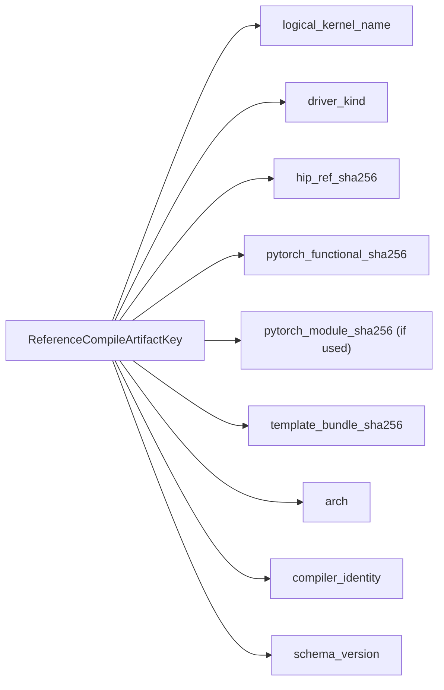
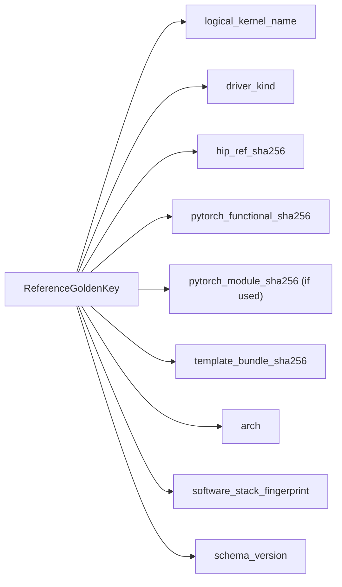
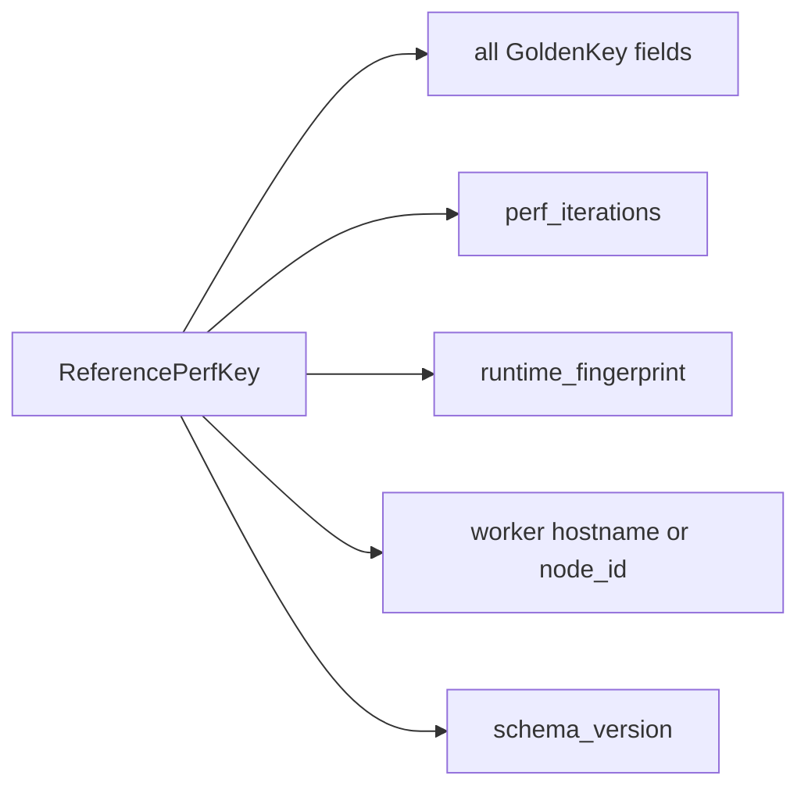
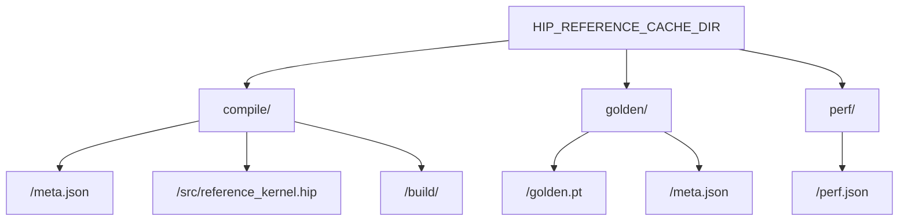

# Reference Cache Design

This document focuses on the cache model used by the HIP kernel evaluation sandbox.

## Why Three Cache Layers

The sandbox distinguishes three different kinds of reference artifacts:

- `reference_compile_artifact`
  - used to reuse a compiled reference HIP extension under a stable reference identity
  - reduces repeated reference compilation without directly reusing correctness or timing verdicts
- `reference_golden`
  - used for correctness comparison
  - must be semantics-preserving when the key matches
- `reference_perf`
  - used for `speedup = reference_perf_ms / candidate_perf_ms`
  - more fragile because runtime drift can contaminate reward quality

Runtime optimization note:

- the cache model is logically split into compile, golden, and perf layers
- on a full cold miss, the online evaluator may use one combined reference execution to obtain both `reference_golden` and `reference_perf_ms`, then publish them into their separate cache artifacts

Operational honesty note:

- warm-cache benchmark wins are not the same thing as current training throughput wins
- if the serving deployment runs with `HIP_ENABLE_REF_GOLDEN_CACHE=0` and `HIP_ENABLE_REF_PERF_CACHE=0`, then training is not currently benefiting from reference cache reuse

## Cache Keys

### `ReferenceCompileArtifactKey`

Use for build-product reuse only.

### `ReferenceGoldenKey`

Use for correctness-only reuse.

### `ReferencePerfKey`

Use for speedup baseline reuse only.

## Runtime Fingerprint

The runtime fingerprint is built in `eval_config.build_runtime_fingerprint()` and is intentionally more restrictive than the golden key. It includes a best-effort snapshot of:

- `hostname`
- `node_id`
- `arch`
- `torch_version`
- `torch_cuda_version`
- `torch_hip_version`
- `gpu_id`
- GPU name / memory / multiprocessor count when probeable

## Cache Layout

## Safety Model

### `reference_compile_artifact`

Safe path when the key is correct:

- compile cache only reuses a build product, not a correctness or perf verdict
- the key includes compiler/software identity, so a torch or runtime stack change invalidates reuse
- reference golden/perf are still executed live when needed

### `reference_golden`

Safe path when the key is correct:

- key is tied to reference code, effective execution bundle, and software stack fingerprint
- golden payload can be stored on CPU to reduce reload overhead
- correctness semantics should not change across cache hits vs misses

### `reference_perf`

Conservative path by design:

- worker-local or node-local scope is preferred
- non-zero TTL should be required to avoid stale perf reuse
- runtime fingerprint mismatch must force live measurement
- cluster-wide aggressive reuse is discouraged unless drift is proven low

## Prewarm Guidance

`server_tools/prewarm_reference_cache.py` supports:

- `--golden-only` as the default mode
- `--with-perf` as an explicit opt-in mode
- perf prewarm requires an explicit `--gpu-id`, because the perf key is per runtime fingerprint and per GPU

Recommended rollout order:

1. enable online `reference_golden` cache first
2. validate correctness hit/miss parity
3. enable and observe `reference_compile_artifact` reuse
4. prewarm `reference_golden`
5. only then consider `reference_perf` cache and `--with-perf`

## Telemetry

The evaluator emits structured timing fields so cache behavior is auditable:

- `reference_compile_cache_hit`
- `reference_golden_cache_hit`
- `reference_perf_cache_hit`
- `reference_compile_build_s`
- `reference_golden_build_s`
- `reference_perf_build_s`
- `reference_perf_cache_ttl_s`

Batch summaries aggregate these fields, and the reward-side batch path can log them alongside `train_step`.

## Rollout Criteria

Do not widen rollout based only on a warm-cache microbenchmark. Require all of the following:

1. Hit/miss parity: cache hits and cold misses must produce the same `compile_ok`, `run_ok`, `match_ok`, and numerically equivalent golden outputs for the same reference identity.
2. Throughput A/B: compare wall-clock batch latency with `golden-only` enabled first, then with `golden + compile artifact`, before using `perf cache` as the explanation for any gain.
3. Speedup drift: when `reference_perf cache` is enabled, compare cached vs live `reference_perf_ms` on a sample of kernels and reject rollout if reward-relevant speedup drift is material.
4. Prewarm hit conditions: perf prewarm is only acceptable when the online workers share the same runtime fingerprint class and the prewarm command pins an explicit `gpu_id`.
5. Provenance auditability: cache entries and runtime logs must retain enough provenance to explain why a perf value was reused, including runtime fingerprint, TTL, and build identity.

## Invalidation Inputs

Any change in these inputs should invalidate cache entries:

- `fix_seed.py`
- `loader_template.py`
- unittest templates
- perf snippet templates
- `CACHE_SCHEMA_VERSION`
- effective arch
- software stack fingerprint for golden cache
- compiler identity for compile cache
- perf iterations for perf cache

These are summarized into `TEMPLATE_BUNDLE_HASH` for key generation.
