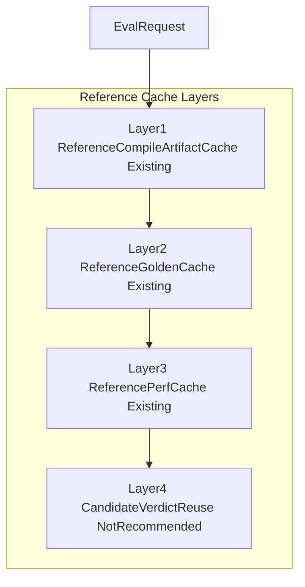
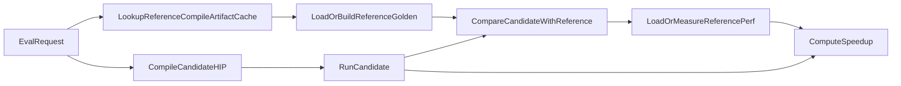

# Reference Cache Layers

This note explains the cache hierarchy around the reward sandbox server and clarifies one easy-to-mix distinction:

- caching a reference result
- caching a reference performance baseline
- caching a compiled reference artifact

The goal is to make the cache design intuitive, auditable, and safe enough for training-time use.

> Key conclusion:
> the complete design should be understood as a three-layer reference-side cache stack.
> The current implementation now includes all three reference-side layers: compile artifact, golden, and perf.

## Why This Note Exists

There are two recurring concerns in practice:

- the primary concern is drift: a cached reference baseline can become inaccurate across different environments, GPUs, software stacks, or time windows
- the secondary concern is reuse efficiency: `reference_perf` is intentionally partitioned by runtime identity, which protects correctness but reduces reuse in parallel multi-GPU evaluation

Those concerns are real, but they affect different cache layers differently.

## One-Sentence Definitions

- `reference compile artifact cache`: cache the compiled reference HIP artifact so the server can skip recompiling the same reference kernel
- `reference_golden cache`: cache the reference output tensors used for correctness comparison
- `reference_perf cache`: cache `reference_perf_ms`, the denominator baseline used for `speedup`
- `candidate verdict reuse`: reuse `compile_ok`, `run_ok`, or `match_ok` across candidate kernels; this is usually not a safe cache layer and should not be treated as part of the reference cache design

## Cache Hierarchy At A Glance

How to read the stack:

- the higher layers are closer to raw build artifacts
- the lower layers are closer to final evaluation outcomes
- the deeper the layer, the more aggressive and fragile the reuse usually becomes

## Online Evaluation Flow With The Full Layered Design

This is the key intuition:

- compile artifact cache removes repeated reference compilation
- golden cache removes repeated reference correctness execution
- perf cache removes repeated reference baseline measurement

## Layer 1: `reference compile artifact cache`

This is now implemented and is the most important additional layer to understand.

### What `reference compile artifact cache` Stores

- the compiled reference HIP artifact itself
- for example, the built extension, loadable binary, build directory, or a compact manifest that points to them

### What `reference compile artifact cache` Answers

- "Do I really need to recompile this reference kernel again?"

### What It Does Not Answer

- it does not say whether the candidate kernel is correct
- it does not say what the final `speedup` is
- it does not say `compile_ok`, `run_ok`, or `match_ok` for the candidate

### Why It Is Valuable

- it cuts repeated reference compilation work from the cold path
- it avoids turning a noisy timing measurement into a long-lived cached baseline
- it improves reuse even when `reference_perf` must remain GPU-local

### Why It Is Safer Than `reference_perf cache`

Because it only reuses a build product. The reference kernel is still executed live when golden or perf values are needed. That means:

- no direct reuse of stale time measurements
- no direct reuse of old correctness tensors
- much smaller risk of silently biasing reward through a stale `speedup` denominator

### Current Status

This layer is now implemented.

The current code defines a dedicated `ReferenceCompileArtifactKey` in [../sandbox_core/cache.py](../sandbox_core/cache.py), persists compile artifacts under `compile/`, and uses that stable artifact path from [../sandbox_core/eval.py](../sandbox_core/eval.py) before reference golden/perf execution.

## Layer 2: `reference_golden cache`

This is the existing correctness-oriented cache layer.

### What `reference_golden cache` Stores

- `reference_golden`
- the reference output tensors used in the `match_ok` comparison

### What `reference_golden cache` Answers

- "What is the reference output for this reference kernel and driver bundle?"

### Why It Exists

- to avoid rerunning the reference correctness path when the same reference identity appears repeatedly
- to reduce repeated reference-side work across multiple candidate variants of the same logical kernel

### Why It Is Only Conditionally Safe

It is relatively safe when its key really captures the semantic identity of the reference path. In the current implementation, this key is represented by `ReferenceGoldenKey` in [../sandbox_core/cache.py](../sandbox_core/cache.py) and includes:

- logical kernel identity
- reference HIP code hash
- PyTorch functional or module code hash
- template bundle hash
- effective arch
- cache schema version

### What It Cannot Safely Replace

- candidate compilation
- candidate execution
- final candidate verdict reuse

### Practical Meaning

`reference_golden cache` helps the `match_ok` path, but by itself it usually does not deliver large end-to-end batch speedups when live perf measurement is still dominant.

This is exactly what the benchmark note in [VALIDATION_RESULTS.md](VALIDATION_RESULTS.md) shows:

- `golden-only` warm runs hit correctly
- but full batch wall time barely changes because `reference_perf` is still measured live

## Layer 3: `reference_perf cache`

This is the existing speedup-oriented cache layer.

### What It Caches

- `reference_perf_ms`

### What Question It Answers

- "What is the reference runtime baseline for this runtime identity?"

### Why It Helps

Once both `reference_golden` and `reference_perf` hit, the server can avoid the entire reference execution path and leave candidate compile and candidate run as the dominant remaining work.

The warm-cache benchmark in [VALIDATION_RESULTS.md](VALIDATION_RESULTS.md) shows the effect clearly:

- `golden + perf` warm second run reduced the 8-task batch from about `44.7s` to about `25.5s`
- `golden-only` did not materially move the full batch wall time

### Why It Is The Fragile Layer

This layer caches a timing number, not just a build artifact or tensor result. That makes it sensitive to:

- GPU identity
- runtime load
- software version drift
- device routing in multi-GPU execution
- elapsed time between prewarm and actual online use

### Proper Mental Model

Treat `reference_perf cache` as:

- worker-local or node-local first
- short-lived
- environment-sensitive
- a throughput optimization, not a truth source

## Layer 4: `candidate verdict reuse`

This layer is intentionally listed as "not recommended" because it is tempting but conceptually different.

### What It Would Try To Reuse

- `compile_ok`
- `run_ok`
- `match_ok`

### Why That Is Usually Wrong

Those are candidate-specific verdicts, not reference-side artifacts.

Two candidate kernels that target the same logical kernel may still differ in:

- code generation quality
- race conditions
- numerical stability
- launch behavior
- correctness against the reference

So this layer should not be treated as part of the reference cache design unless there is an exact candidate identity cache with very strict invalidation.

## Recommended Design Boundary

The cleanest boundary is:

- `reference compile artifact cache` is allowed to reuse build products
- `reference_golden cache` is allowed to reuse correctness baselines
- `reference_perf cache` is allowed to reuse speedup baselines under strict scope control
- candidate verdicts should remain live evaluation outputs

In short:

- reuse objects first
- reuse measured values second
- do not reuse final judgments across different candidate kernels

## Safety Order

From safest to most aggressive:

1. `reference_golden cache`
2. `reference compile artifact cache`
3. `reference_perf cache`
4. candidate verdict reuse

This ordering is operational, not philosophical:

- correctness baselines are the first rollout target because they directly preserve the `match_ok` comparison path
- build products are still safer to reuse than timing numbers
- correctness tensors are usually safer to reuse than speedup baselines
- verdict reuse is the easiest way to hide real regressions

## Relation To The Current Implementation

Today the codebase already implements the following:

- `ReferenceCompileArtifactKey` and compile artifact storage in [../sandbox_core/cache.py](../sandbox_core/cache.py)
- `ReferenceGoldenKey` and golden artifact storage in [../sandbox_core/cache.py](../sandbox_core/cache.py)
- `ReferencePerfKey` and perf artifact storage in [../sandbox_core/cache.py](../sandbox_core/cache.py)
- online lookup and store logic in [../sandbox_core/eval.py](../sandbox_core/eval.py)
- reference cache design and rollout guidance in [REFERENCE_CACHE.md](REFERENCE_CACHE.md)
- real throughput observations in [VALIDATION_RESULTS.md](VALIDATION_RESULTS.md)
- batch/runtime telemetry for compile, golden, and perf cache effectiveness

What still needs operational validation:

- hit/miss parity checks before broader rollout
- A/B throughput measurement with compile cache plus golden cache enabled
- speedup drift checks before enabling wider perf prewarm reuse

## Why This Layering Matters For The Current Problem

If the main concern is:

- "reference compilation and perf cache may drift across environment, stage, and time"

then the right response is not:

- "cache more verdicts"

The right response is:

- separate the cache by abstraction level
- keep `reference_perf` conservative
- add a compile artifact cache so more throughput gain comes from build reuse rather than timing reuse

That is the central design insight of this note.

## Practical Rollout Guidance

If the goal is to improve sandbox throughput without corrupting reward quality, the rollout order should be:

1. keep `reference_golden` and `reference_perf` conceptually separate
2. add `reference compile artifact cache` before expanding `reference_perf` reuse
3. enable `reference_golden cache` first and validate hit/miss parity
4. use `reference_perf cache` only with explicit runtime scope, TTL, and provenance
5. avoid candidate verdict reuse unless exact candidate identity caching is intentionally designed and reviewed

## Controlled Smoke Benchmark

To make the layer boundaries concrete, we ran a controlled 8-way warm-cache benchmark against one real training sample from:

- `dataset/kernel-agent-single-sft-1125/rl_data_v01_mi325x_react_verl.parquet`

Benchmark setup:

- use one real compilable sample: `hip_linear_bias_sigmoid_kernel_rb`
- exclude `relu6_kernel` from the comparison because, on the current ROCm/PyTorch stack, it fails compilation with an `at::conv2d` overload ambiguity and would confound cache analysis
- dispatch 8 concurrent requests that share the same reference identity but use different candidate suffixes
- pin requests to GPUs `0..7` with 8 worker processes
- enable deterministic CPU affinity splitting so each worker process stays on a distinct CPU core group during the run
- compare the warm second run under four configs: `no-cache`, `golden-only`, `golden+compile`, `golden+compile+perf`

Warm-run results:

| Config | Warm wall time | Main hit pattern | Interpretation |
| --- | --- | --- | --- |
| `no-cache` | `53.16s` | no reference cache hits | baseline |
| `golden-only` | `54.66s` | `reference_golden_cache_hit=8/8` | correctness path is reused, but end-to-end wall time barely moves |
| `golden+compile` | `36.90s` | `reference_compile_cache_hit=8/8`, `reference_golden_cache_hit=8/8` | largest single-stage wall-clock gain in this workload |
| `golden+compile+perf` | `31.32s` | `reference_golden_cache_hit=8/8`, `reference_perf_cache_hit=8/8` | best total throughput, with an additional but smaller gain from perf reuse |

Observed wall-clock benefit ordering on this workload:

1. `reference compile artifact cache`
2. `reference_perf cache`
3. `reference_golden cache`

This is intentionally different from the safety / rollout ordering. In other words:

- safety ordering is still `reference_golden` > `reference compile artifact` > `reference_perf`
- observed wall-clock benefit on this real sample was `reference compile artifact` > `reference_perf` > `reference_golden`

## Why `golden-only` Hits Did Not Move Wall-Clock

The `golden-only` result is not a contradiction. It follows directly from the evaluator pipeline:

- a golden hit only answers "what is the correct reference output?"
- it does not answer "what is the reference perf denominator?"
- if `reference_perf` is still missing, the evaluator must still enter the reference compile / perf path
- in that case, the batch can remain dominated by `REF_COMPILE_RUN` and `REF_PERF_RUN`, so skipping only the golden build does not materially reduce wall-clock

This is why `golden-only` can hit correctly while producing little or no end-to-end throughput gain.

There is a related telemetry subtlety:

- in a full warm hit where both golden and perf already hit, the evaluator never needs to visit the reference compile path
- therefore `reference_compile_cache_hit` may stay absent even though the compile artifact cache is real and useful
- the compile layer is easiest to observe in the `golden+compile` configuration or in a forced "compile-hit / perf-miss" experiment

## Risks Of Defaulting To `golden+compile`

If the sandbox defaults to `golden+compile`, the trade-off is reasonable but not free of risk.

What this default does well:

- it avoids caching `reference_perf_ms`, so it does not directly freeze a stale speedup denominator into reward
- it captures the largest measured wall-clock gain on the real workload without relying on perf reuse
- it keeps the rollout more conservative than `golden+compile+perf`

What can still go wrong:

- `reference_golden` is still not an absolute truth source; it is only as safe as its key and the software-stack fingerprint it binds
- the compile artifact key is still an approximation of toolchain identity; if the practical compiler/runtime stack changes without changing the tracked fingerprint, an old build can still be reused
- compile artifacts currently have no TTL, no explicit garbage collection, and no singleflight lock, so cold parallel misses can still stampede into repeated reference compilation
- because `reference_perf` remains live in this mode, the reward path still inherits runtime load noise and perf measurement latency
- node-local compile artifacts can hide cold-compile regressions; a hot worker may continue to succeed while a fresh worker or fresh key still fails reference compilation

So the right mental model is:

- `golden+compile` is a good default for conservative throughput improvement
- `golden+compile` is not a proof that correctness is absolutely frozen
- `golden+compile` still needs telemetry, cold-path canaries, and compile-cache hygiene if promoted to a long-lived production default

## Final Summary

The cache hierarchy should be understood as three core reference-side layers:

- compiled reference artifact reuse
- reference correctness result reuse
- reference performance baseline reuse

All three are implemented today.

If you want higher throughput without paying for fragile `speedup` reuse, the main practical lesson is not to expand perf caching first. The safer rollout still starts with `reference_golden`, but the largest wall-clock gain on the measured real workload came from adding `reference compile artifact cache`, with `reference_perf cache` providing the final incremental reduction once correctness and compile reuse were already in place.
