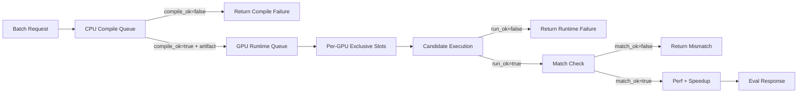

# Sandbox Server Compilation Throughput Optimization

## Executive Summary

The sandbox server throughput bottleneck was not a lack of Gunicorn workers. The real bottleneck was that CPU-heavy compilation and GPU-exclusive runtime validation were coupled inside one per-kernel evaluation chain.

The implemented optimization splits batch evaluation into:

- A CPU compile pool sized by `HIP_COMPILE_CPU_SLOTS`.
- A GPU runtime pool that preserves one-kernel-at-a-time exclusivity per GPU while producing `run_ok`, `match_ok`, and `speedup`.

Smoke tests show clear throughput gains:

| Dataset | Batch | Baseline Wall Time | Two-Stage Wall Time | Baseline Throughput | Two-Stage Throughput | Speedup |
|---|---:|---:|---:|---:|---:|---:|
| Synthetic EDMLoss repeat | 16 | 158.78s | 108.91s | 6.05 kernels/min | 8.81 kernels/min | 1.46x |
| Legacy KernelBench | 25 | 303.39s | 159.66s | 4.94 kernels/min | 9.39 kernels/min | 1.90x |
| Legacy KernelBench x2 | 50 | n/a | 263.03s | n/a | 11.41 kernels/min | n/a |

The best default batch size for this host is currently `64`. Batch `128` is allowed as a pressure-test candidate, but it should not be the default until memory, filesystem, and ROCm compiler stability are proven over repeated runs.

## Current Default Configuration

The deployment script publishes the recommended batch size:

```bash
HIP_DEFAULT_BATCH_SIZE=64
```

This is intentionally a client-side recommendation. The `/run_code_batch` API accepts whatever number of requests the caller sends; the server does not rewrite or clamp the request body batch size.

Current recommended server-side knobs:

```bash
HIP_ENABLE_TWO_STAGE_BATCH=1
HIP_DEFAULT_BATCH_SIZE=64
HIP_COMPILE_CPU_SLOTS=16
HIP_COMPILE_INNER_JOBS=4
HIP_TOOL_MAX_CPU_JOBS=16
MAX_JOBS=4
OMP_NUM_THREADS=1
MKL_NUM_THREADS=1
OPENBLAS_NUM_THREADS=1
```

On this machine, `nproc` reported 108 visible CPUs and 8 GPUs. With `HIP_COMPILE_CPU_SLOTS=16` and `HIP_COMPILE_INNER_JOBS=4`, the effective compile pressure target is roughly 64 compiler jobs.

## Architecture

Before optimization, one worker handled all steps for one kernel:


That design sized the whole pipeline by GPU count. If 8 GPUs were available, only 8 kernels moved through compilation at once, even though compilation is mostly CPU-bound.

The optimized design separates resource ownership:



The stages overlap. A compile future that finishes is immediately submitted to an idle GPU runtime slot while other compile jobs continue. This is a pipeline, not a barrier after all compilation.

## Result State Machine

The evaluation semantics remain unchanged:

```text
compile_ok=false
  -> stop after CPU compile stage

compile_ok=true, run_ok=false
  -> candidate execution failed

compile_ok=true, run_ok=true, match_ok=false
  -> correctness mismatch

compile_ok=true, run_ok=true, match_ok=true
  -> speedup is valid
```

This distinction matters. The second stage is not just "perf"; it is GPU-exclusive runtime validation.

## Smoke Test Results

### Synthetic EDMLoss Repeat, Batch 16

Configuration:

```text
HIP_PERF_ITERATIONS=5
HIP_COMPILE_CPU_SLOTS=16
HIP_COMPILE_INNER_JOBS=4
8 GPUs
```

| Mode | Wall Time | Throughput | Success |
|---|---:|---:|---:|
| Single-chain baseline | 158.78s | 6.05 kernels/min | 16/16 |
| Two-stage | 108.91s | 8.81 kernels/min | 16/16 |

Observed speedup:

```text
158.78 / 108.91 = 1.46x
```

### Legacy KernelBench, Batch 25

Dataset:

```text
HIP_benchmark_kit/data/legacy/hip_eval_neurlps/hip_eval_dataset_kernelbench_25_tasks
```

| Mode | Wall Time | Throughput | Success |
|---|---:|---:|---:|
| Single-chain baseline | 303.39s | 4.94 kernels/min | 25/25 |
| Two-stage | 159.66s | 9.39 kernels/min | 25/25 |

Observed speedup:

```text
303.39 / 159.66 = 1.90x
```

### Legacy KernelBench x2, Batch 50

The legacy 25-kernel set was repeated twice to create a batch of 50.

| Mode | Wall Time | Throughput | Success |
|---|---:|---:|---:|
| Two-stage | 263.03s | 11.41 kernels/min | 50/50 |

Stage averages:

| Stage | Average |
|---|---:|
| Candidate compile | 29.26s |
| Reference compile | 29.20s |
| Candidate test run | 8.76s |
| Reference run | 8.79s |
| Runtime stage total | 19.33s |

The throughput improvement from batch 25 to batch 50 shows that larger batches fill the compile and runtime pipeline more effectively.

## Batch Size Guidance

Recommended default:

```text
batch_size=64
```

Rationale:

- Batch 25 already shows 1.90x wall-time speedup.
- Batch 50 reaches 11.41 kernels/min, higher than batch 25's 9.39 kernels/min.
- The pipeline still benefits from larger batches because compile jobs dominate runtime jobs.
- Batch 64 gives more room to keep `16` compile slots and `8` runtime slots busy without turning every request into an excessive pressure test.

Guidance:

| Batch Size | Recommendation | Reason |
|---:|---|---|
| 32 | Conservative | Stable and enough to fill the pipeline, but more tail effects. |
| 64 | Default | Best current balance between throughput and operational risk. |
| 96 | Optional tuning | Reasonable if memory, `/tmp`, and cache growth are stable. |
| 128 | Pressure test | Can be tested, but do not use as default without repeated stability evidence. |

## Compile Slots Guidance

`HIP_COMPILE_CPU_SLOTS` can be increased, but increasing it blindly is not engineering discipline.

The real pressure is approximately:

```text
effective_compile_jobs = HIP_COMPILE_CPU_SLOTS * HIP_COMPILE_INNER_JOBS
```

Current default:

```text
16 * 4 = 64 effective compiler jobs
```

On a 108-CPU host, this is a reasonable starting point. Increasing to 24 slots with 4 inner jobs would target about 96 compiler jobs, which may still be possible but is materially riskier.

Recommended tuning matrix:

| Compile Slots | Inner Jobs | Effective Jobs | Use Case |
|---:|---:|---:|---|
| 16 | 4 | 64 | Current default. Balanced and validated by smoke tests. |
| 24 | 3 | 72 | Safer next tuning point. More outer parallelism without too much inner fanout. |
| 32 | 2 | 64 | More kernels compiling concurrently, lower per-kernel inner pressure. |
| 24 | 4 | 96 | Aggressive. Test only with memory and filesystem monitoring. |
| 32 | 4 | 128 | Not recommended as default. Likely to expose compiler, memory, or IO pressure. |

Prefer `24x3` or `32x2` before trying `24x4`. Do not jump directly to `32x4`.

## Operational Risks

Larger batches and more compile slots stress different subsystems:

- Host memory and swap.
- `/tmp` capacity and inode count.
- PyTorch extension build directories.
- Reference cache metadata and artifact writes.
- ROCm/LLVM compile stability.
- File descriptor count.
- Batch tail latency from slow compiles.
- GPU perf variance if the host is overloaded during runtime measurement.

The goal is not 100 percent CPU utilization. The goal is higher throughput with stable `compile_ok`, `run_ok`, `match_ok`, and low perf noise.

## Monitoring Checklist

During tuning, monitor:

```text
CPU utilization and run queue
memory and swap
/tmp disk usage and inode usage
reference_cache disk usage
compile timeout rate
ROCm/hipcc intermittent failures
GPU utilization and runtime variance
batch p50/p95/p99 wall time
```

Use `/health` to confirm:

- `two_stage_batch_enabled`
- `compile_cpu_slots`
- `compile_inner_jobs`
- `gpu_count`
- `tool_scheduler.cpu_slots`

## Conclusion

The two-stage design is the right direction. It preserves GPU-exclusive runtime validation while allowing CPU-heavy compilation to scale independently. Current evidence supports:

```text
batch_size=64
HIP_COMPILE_CPU_SLOTS=16
HIP_COMPILE_INNER_JOBS=4
```

The next safe tuning step is not batch 128 or compile slots 32 immediately. It is to test `batch_size=64` under normal training load, then evaluate `24x3` or `32x2` compile settings if CPU utilization remains low and system pressure stays stable.
