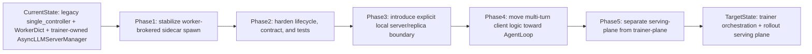

# VERL v0.7 Gap And Roadmap

This note turns the upstream `verl` v0.7 architectural signals into an engineering roadmap for this fork.

Use this together with [MULTI_TURN_AGENTIC_RL_ARCHITECTURE.md](MULTI_TURN_AGENTIC_RL_ARCHITECTURE.md):

- the architecture note explains what the branch is doing now
- this roadmap explains what should be stabilized short term and what should be migrated medium term

## Executive Judgment

This branch is trying to host a new rollout-server problem inside an old `legacy FSDP/Ray trainer-side async patch` boundary.

That boundary can still be stabilized, and it should be stabilized if the immediate goal is to get this branch running reliably. But it should not be mistaken for the destination architecture.

The practical judgment is:

- **short term**: keep investing in `WorkerDict / rollout-worker-brokered sidecar spawn`, because that is the most native stopgap available inside the current branch
- **medium term**: stop treating `AsyncLLMServerManager -> AsyncvLLMServer` as the final abstraction and migrate toward a stronger `server/replica/AgentLoop` shape

## Why This Is Not Just A Bug Fix

- Upstream v0.7 already removed legacy SPMD rollout and made rollout server mode the default.
- Upstream added `AgentLoop` specifically so multi-turn and tool-calling would stop being hidden in ad hoc trainer logic.
- The fully-async docs explicitly define Trainer as control-plane and Rollouter as serving-plane with resource isolation.
- The v0.8 roadmap explicitly says the vLLM worker should be separated from the trainer process.

So the core issue is not merely `CUDA_VISIBLE_DEVICES` propagation. The core issue is that this branch is still carrying a serving workload on a legacy trainer-side seam that upstream is already trying to leave behind.

## Upstream vs Local Gap Matrix

| Concern | Upstream v0.7 direction | Current local branch | Engineering meaning |
|---|---|---|---|
| Rollout ownership | `server mode` is the default rollout mode. | Async rollout is still entered from `RayPPOTrainer` through `AsyncLLMServerManager`. | The trainer still owns too much serving lifecycle state. |
| Server-to-worker contract | `vLLMReplica` and `vLLMHttpServerBase` own `workers: list[ActorHandle]` explicitly. | `AsyncvLLMServer` reaches GPU workers indirectly through `ExternalRayDistributedExecutor` and `WorkerDict` naming. | Binding is implicit and fragile. |
| GPU runtime provenance | Replica construction keeps worker/server placement coupled. | `Worker.spawn_colocated_async_server()` now forwards `CUDA_VISIBLE_DEVICES` into a CPU sidecar runtime. | This is the correct stopgap, but it is still a bridge rather than a first-class replica abstraction. |
| Multi-turn client loop | `AgentLoop` is a first-class upstream client abstraction. | `ChatCompletionScheduler` plus `ToolCompletionCallback` live in trainer-owned scheduling code. | The branch has the behavior but not yet the right abstraction boundary. |
| Resource model | Fully async uses explicit Trainer and Rollouter resource separation. | Async rollout still overlays on legacy colocated `actor_rollout_wg` plus a sidecar. | Resource semantics are improving, but the serving plane is not independently modeled. |
| Future direction | v0.8/v0.9 keep pushing toward more serving-plane isolation and fewer legacy engines. | Current fixes still add weight to legacy `single_controller` async seams. | Short-term work is necessary, but should be designed to be disposable. |

## Roadmap At A Glance

## Short-Term Roadmap: Native Stopgap On Current Branch

The short-term goal is not to make the branch beautiful. The short-term goal is to make the current architecture reliable while putting the responsibility in the least wrong place.

### Workstream 1: Make The Rollout Worker The Only Source Of GPU Runtime Truth

Goal:
Ensure that GPU visibility, node identity, and sidecar spawn authority all originate from the rollout worker that already owns the real Ray GPU context.

Files in scope:

- `verl/verl/single_controller/base/worker.py`
- `verl/verl/workers/rollout/async_server.py`
- `verl/verl/workers/rollout/vllm_rollout/vllm_async_server.py`

Concrete tasks:

- Keep exactly one canonical `spawn_colocated_async_server()` implementation in `worker.py`.
- Remove any remaining manager-side or helper-side logic that tries to reconstruct `CUDA_VISIBLE_DEVICES`.
- Treat missing or empty worker-side visible-device state as a hard error, not a soft warning.
- Normalize sidecar init arguments so there is one authoritative device provenance path rather than multiple fallback fields.
- Log enough spawn metadata to reconstruct `worker_rank -> dp_rank -> node_id -> visible_devices` when debugging failures.

Exit criteria:

- The sidecar always starts from worker-owned GPU provenance rather than coordinator-side guessing.
- There is no remaining call site that tries to infer GPU visibility outside the rollout worker.
- Failures in worker-side device provenance are loud and immediately attributable.

### Workstream 2: Harden Sidecar Identity, Lifecycle, And Failure Semantics

Goal:
Make sidecar creation, restart, initialization, and teardown predictable instead of semi-implicit.

Files in scope:

- `verl/verl/workers/rollout/async_server.py`
- `verl/verl/single_controller/base/worker.py`

Concrete tasks:

- Make sidecar naming deterministic from `wg_prefix` and DP rank.
- Keep explicit kill-and-recreate behavior when a stale sidecar with the same name exists.
- Ensure `init_engine()` success is the only point at which a sidecar is considered ready.
- Make the restart loop in `AsyncLLMServerManager` clearly about address/liveness issues, not silent masking of contract bugs.
- Clarify whether teardown ownership belongs to the manager, the worker, or both.

Exit criteria:

- Sidecar startup and restart behavior are deterministic.
- The branch can explain who owns sidecar lifecycle and where to look when it breaks.
- `wake_up()` and `sleep()` are never racing an uninitialized sidecar.

### Workstream 3: Replace Prefix-Based Actor Discovery With Explicit Actor Identity

Goal:
Reduce the most brittle part of the current design: the hidden dependency on deprecated `WorkerDict` actor naming.

Files in scope:

- `verl/verl/workers/rollout/vllm_rollout/vllm_async_server.py`
- `verl/verl/single_controller/ray/base.py`
- `verl/verl/workers/rollout/async_server.py`

Concrete tasks:

- Stop scanning all named actors by prefix when a narrower identity contract is possible.
- Prefer passing explicit actor names or worker handles for the relevant DP group into the sidecar path.
- If full handle-passing is too invasive short term, pass an explicit actor-name list rather than a prefix to scan.
- Add early assertions that fail if the async path is paired with a worker layout it does not support, such as a future `FusedWorker`-only configuration.
- Document the temporary dependence on deprecated `create_colocated_worker_cls()` until the medium-term migration removes it.

Exit criteria:

- The async vLLM path no longer depends on global actor-name discovery by prefix alone.
- Breakage from worker layout changes becomes explicit and immediate instead of silent.
- The dependency on `WorkerDict` is documented as technical debt instead of being hidden.

### Workstream 4: Add Regression Coverage And Observability Around The Real Contract

Goal:
Stop debugging this path as folklore. Turn the actual contract into tests and logs.

Files in scope:

- `verl/tests/workers/rollout/test_chat_scheduler_tool_lifecycle.py`
- nearby async rollout tests under `verl/tests/workers/rollout/`
- `hip_kernel_evaluation_server/sandbox_tests/test_tool_runtime.py`
- `hip_kernel_evaluation_server/sandbox_tests/test_server_contracts.py`

Concrete tasks:

- Add focused coverage for worker-brokered sidecar spawn and visible-device propagation.
- Add coverage for DP-rank to worker-group binding assumptions.
- Add coverage for failure when worker-side device provenance is missing or inconsistent.
- Add coverage for sidecar restart behavior when the server name already exists.
- Log request identifiers, sidecar identity, and worker-group binding metadata in the rollout path.

Exit criteria:

- The main async rollout contract is covered by tests, not only by manual reproduction.
- Logs are sufficient to distinguish tool-runtime issues from rollout-serving issues.
- Regressions in sidecar spawn or actor binding fail fast in CI.

### Short-Term Success Definition

Short-term work is complete when all of the following are true:

- worker-owned GPU provenance is the single source of truth
- sidecar lifecycle is deterministic
- actor binding is explicit enough to survive routine refactors
- there is regression coverage for the real failure modes

That is the correct place to stop if the immediate goal is to get experiments running again.

## Mid-Term Roadmap: Move Toward Upstream Shape

The medium-term goal is to stop carrying the serving system on a legacy trainer-side seam.

### Phase A: Introduce An Explicit Local Server/Replica Boundary

Design target:

- a local replica object owns worker handles for one rollout DP group
- the replica object owns its server handle(s), placement metadata, and lifecycle
- the trainer talks to replica-level interfaces instead of constructing raw sidecars through a trainer-owned manager

Likely areas to refactor:

- `verl/verl/workers/rollout/async_server.py`
- `verl/verl/workers/rollout/vllm_rollout/vllm_async_server.py`
- a likely new local replica module under `verl/verl/workers/rollout/`

Why this phase matters:

- it removes the strongest structural gap relative to upstream `vLLMReplica`
- it turns worker/server binding from a naming convention into an object boundary
- it gives later resource isolation and weight-sync work a stable home

### Phase B: Promote Multi-Turn Client Logic Into An AgentLoop-Like Abstraction

Design target:

- request state, conversation state, tool lifecycle, and resubmission logic live in a dedicated client abstraction
- trainer code submits work and receives outputs, but does not directly own callback choreography

Likely source files:

- `verl/verl/workers/rollout/chat_scheduler.py`
- `verl/verl/tools/hip_kernel_eval_tool.py`
- `dataset/multi_turn_tools.py`

Why this phase matters:

- it aligns the local client boundary with upstream `AgentLoop`
- it isolates multi-turn logic from trainer threading details
- it makes later partial-rollout and fully-async migration much more tractable

### Phase C: Separate Serving-Plane From Training-Plane Semantics

Design target:

- serving resources and training resources become independently modeled
- parameter update or weight sync becomes an explicit interface, not an accidental by-product of trainer ownership
- `wake_up()` and `sleep()` stop being the main architecture boundary

Likely implications:

- separate resource pools or at least separate resource contracts
- explicit update / sync hooks between trainer-side model state and rollout-serving state
- a path toward checkpoint-engine or CUDA-IPC-style thinking without committing to it prematurely

Why this phase matters:

- upstream v0.7 fully-async and v0.8 roadmap both point in this direction
- the long-tail and agentic-serving problems get worse, not better, if the serving plane stays subordinate to trainer-side orchestration

### Phase D: Retire Legacy WorkerDict Dependence

Design target:

- async rollout no longer relies on deprecated `create_colocated_worker_cls()` naming
- server-to-worker binding survives alternative worker layouts
- the old `trainer -> manager -> CPU sidecar -> actor name scan` chain can eventually disappear

Why this phase matters:

- this is where the branch stops paying ongoing debt to the old `single_controller` async seam
- without this step, every new serving feature will keep getting bolted onto the wrong boundary

## Decision Gates / Exit Criteria

| Gate | Requirement | Evidence |
|---|---|---|
| `Gate S1` | Current branch is stable on the native stopgap. | Worker-owned GPU provenance, deterministic sidecar lifecycle, explicit enough actor binding, and regression tests. |
| `Gate M1` | Replica boundary exists locally. | Sidecar and worker handles are owned by a replica-level object rather than only by trainer-owned manager logic. |
| `Gate M2` | Multi-turn loop is no longer trainer callback glue. | An `AgentLoop`-like client abstraction owns conversation and tool lifecycle state. |
| `Gate M3` | Serving-plane and training-plane are independently modeled. | Resource ownership and weight/update boundaries are explicit. |
| `Gate M4` | Legacy async seam is no longer load-bearing. | Async rollout no longer depends on `WorkerDict` naming tricks or trainer-side sidecar orchestration. |

## Recommended Investment Strategy

If the goal is **to get this branch running soon**:

- finish all short-term workstreams
- stop at `Gate S1`
- avoid mixing in large abstraction rewrites during stabilization

If the goal is **to reduce wrong-abstraction debt while still making progress**:

- still finish short-term workstreams first
- start Phase A design work in parallel once worker-owned sidecar spawn is stable
- treat Phase B as the next meaningful architectural step, because that is where local multi-turn logic starts resembling upstream `AgentLoop`

If the goal is **to become upstream-aligned over time**:

- do not spend multiple iterations polishing the legacy manager chain
- use short-term fixes only to buy time for the replica and client-boundary migration

## Non-Goals

- Do not treat the short-term stopgap as the final design.
- Do not rewrite the tool runtime first; the main debt is the rollout-serving boundary.
- Do not assume a full upstream rebase is required before any progress can be made.
- Do not keep adding features to the legacy async seam without first deciding whether they belong in the future server/replica boundary instead.

## Related Docs

- [MULTI_TURN_AGENTIC_RL_ARCHITECTURE.md](MULTI_TURN_AGENTIC_RL_ARCHITECTURE.md)
