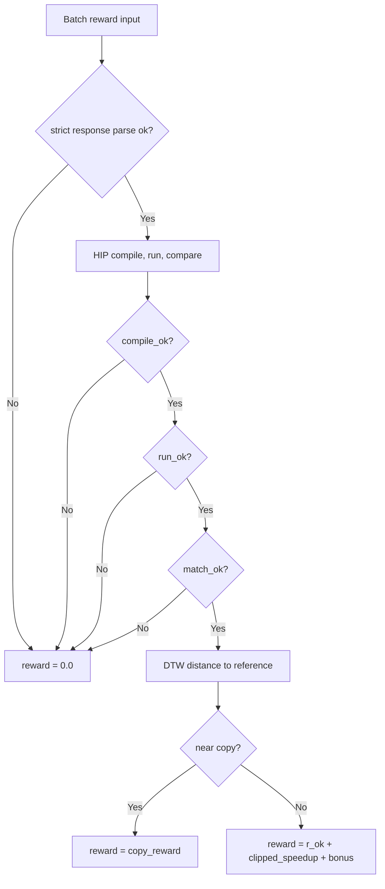

# HIP Kernel Reward Flow

Current training launchers call `reward/reward_batch.py` through the batch
reward manager. Select the scoring formula with `REWARD_MODE` or the launcher
flag `--reward-mode`.

## Mode Table

| Mode | Status | Failure gates | Success reward | Copy handling |
|------|--------|---------------|----------------|---------------|
| `correct_speedup_copy_penalty` | Production default | compile/run/match/parse failure -> `0.0` | `r_ok + clip(speedup, 0, cap) + optional_bonus` | near-copy -> `copy_reward` |
| `soft_clip_novelty` | Alternative exploration mode | compile -> `-0.9`, run -> `-0.7`, match -> `-0.3` | `r_ok + beta * clip(speedup - 1, -a, b) + alpha * (novelty - 0.5)` | near-copy capped at `-0.2` |
| legacy default | Compatibility path | compile -> `-0.9`, run -> `-0.5`, match -> `0.0` | `0.5 + log1p(speedup) / log1p(100) + diversity_bonus` | near-copy -> `-0.2` |

The default in `scripts/train/react_*` is:

```bash
REWARD_MODE="correct_speedup_copy_penalty"
```

## Production Default

`correct_speedup_copy_penalty` is correctness-first and intentionally simple.
Invalid generations receive no positive reward and are not distinguished by
negative gates.



Config:

| Parameter | Default | Source |
|-----------|---------|--------|
| `REWARD_CORRECT_SPEEDUP_R_OK` | `0.3` | launcher flag or env |
| `REWARD_CORRECT_SPEEDUP_CAP` | `10` | launcher flag or env |
| `REWARD_CORRECT_SPEEDUP_COPY_REWARD` | `0.0` | launcher flag or env |
| `REWARD_CORRECT_SPEEDUP_BONUS` | `0.3` | env only |
| `REWARD_CORRECT_SPEEDUP_BONUS_THRESHOLD` | `1.1` | env only |

With the defaults, a correct non-copy kernel at speedup `2.0` receives
`0.3 + 2.0 + 0.3 = 2.6` because the bonus threshold is crossed. A copy receives
`0.0`.

## Soft Clip Novelty

Use `REWARD_MODE=soft_clip_novelty` when you want explicit negative pressure for
compile, runtime, or correctness failures plus a small DTW novelty term. This
mode has a different reward scale from the production default; do not switch it
mid-experiment without retuning filters and learning-rate assumptions.

Config:

| Parameter | Default |
|-----------|---------|
| `REWARD_SOFT_EPS` | `1e-6` |
| `REWARD_SOFT_A` | `1` |
| `REWARD_SOFT_B` | `9` |
| `REWARD_SOFT_R_OK` | `0.3` |
| `REWARD_SOFT_BETA` | `0.5` |
| `REWARD_SOFT_ALPHA` | `0.5` |

## Operational Notes

- `REWARD_MODE` resolution order is reward kwargs, then `extra_info`, then env.
- Parse failures are scored before server evaluation and therefore do not
  consume HIP compile/run resources.
- `reward/reward.py` is the legacy single-sample scorer. Current training
  scripts point at `reward/reward_batch.py`.
- `kernel_novelty_tracker` records observability data; it does not change the
  reward value.
