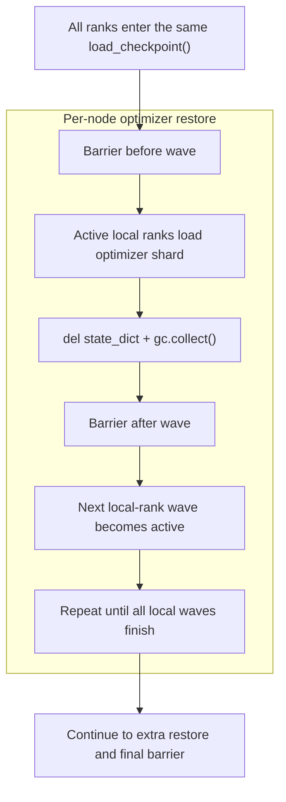

# FSDP Strict Resume OOM Fix

## One-Page Summary

这份说明只回答 3 件事：

- 为什么 strict resume 会在初始化阶段 OOM
- 这次修复的工程思想是什么
- 当前实现的 pipeline 和配置入口在哪里

本方案的目标不是“恢复更快”，而是先让 **严格继续训练** 稳定完成：

- 保留 `model + optimizer + extra` 的完整恢复语义
- 不修改 checkpoint 文件格式
- 不在第一版中冒险改变 FSDP model load 的分布式语义
- 优先压低 `optimizer` 恢复阶段的 CPU 峰值

## Core Idea

旧问题的本质是：所有 rank 同时进入 `load_checkpoint()`，并在同一段逻辑里连续恢复 `model shard` 和更大的 `optimizer shard`，导致单节点 RSS 峰值过高。

这次修复只做最必要的事：

1. 把恢复拆成 `model -> optimizer -> extra` 三个 phase，避免峰值叠加。
2. 所有 rank 仍进入同一个 `load_checkpoint()`，不在 driver 侧分批 RPC，避免 barrier / collective 死锁。
3. 只对 `optimizer` 恢复做 per-node local-rank wave 节流，因为它更大、收益最高、语义风险更低。
4. 加入 `mmap`、显式 `del + gc.collect()` 和 RSS 日志，降低峰值并提高可观测性。

## End-To-End Pipeline

```mermaid
flowchart LR
    subgraph trainer [Trainer]
        trainerLoad["RayPPOTrainer._load_checkpoint"]
    end

    subgraph workerGroup [Ray Worker Group]
        actorWG["actor_rollout_wg.load_checkpoint"]
        actorWorker["ActorRolloutRefWorker.load_checkpoint"]
    end

    subgraph checkpointManager [FSDP Checkpoint Manager]
        configStage["Read checkpoint config"]
        modelStage["Phase1 model restore"]
        optimizerStage["Phase2 optimizer restore"]
        extraStage["Phase3 extra restore"]
        finishStage["Final barrier"]
    end

    trainerLoad --> actorWG
    actorWG --> actorWorker
    actorWorker --> configStage
    configStage --> modelStage
    modelStage --> optimizerStage
    optimizerStage --> extraStage
    extraStage --> finishStage
```



## Why This Design

### Correctness First

这不是“仅恢复模型”的轻恢复，而是 strict resume，因此必须保留：

- model state
- optimizer state
- lr scheduler state
- RNG state

### Smallest Safe Change

第一版不串行化 `model` 恢复，只节流 `optimizer` 恢复。原因很简单：

- `optimizer` 更大，节流收益最大
- `Optimizer.load_state_dict()` 更像本地对象恢复，边界更清晰
- `model` 的 FSDP sharded load 更可能依赖更紧的 distributed 语义，过早改它风险更高

### All Ranks Stay In One Call

不能把 `load_checkpoint()` 在 driver 侧拆成几批 RPC。  
当前路径里有 `ONE_TO_ALL` 和 `barrier`，如果部分 rank 已进入、部分 rank 尚未进入，最容易直接死锁。

因此当前实现保持：

- 所有 rank 一起进入同一个 `load_checkpoint()`
- 只有当前 wave 内的 local rank 执行重载入逻辑
- 其他 local rank 在 barrier 等待

## Optimizer Wave Throttling



这里的关键直觉是：

- 不是把整个 world 串成 1 条线
- 而是每个节点只允许少量 local rank 同时做最重的 `optimizer` 恢复
- 这样可以降低单节点峰值，同时保持全局同步结构不变

## Current Implementation

### Phase 1: Model Restore

- 继续使用原有 `FSDP SHARDED_STATE_DICT` 语义
- 每个 rank 加载自己的 model shard
- 恢复后立刻 `del model_state_dict`
- 调用 `gc.collect()`
- 记录 RSS 并 barrier

### Phase 2: Optimizer Restore

- 优先读取 `RAY_LOCAL_RANK` / `RAY_LOCAL_WORLD_SIZE`
- 按 `load_optimizer_local_concurrency` 切 wave
- wave 内 active local rank 执行 `torch.load()` 和 `load_state_dict()`
- wave 结束后立刻释放临时对象并 `gc.collect()`

### Phase 3: Extra Restore

- 恢复 `RNG` 和 `lr scheduler`
- 保持轻量 phase
- 恢复后同样显式释放并记录 RSS

## `mmap` And Explicit `gc`

### `torch.load(..., mmap=True)`

`mmap` 是 best-effort 优化：

- 支持时可降低反序列化的 CPU 峰值
- 不支持时自动 fallback 到普通 `torch.load()`
- 正确性不依赖 `mmap`

### `del + gc.collect()`

这不是样式问题，而是峰值控制。  
如果不在 phase 或 wave 结束后尽早释放大对象，RSS 很容易继续挂高并叠加到后续恢复步骤上。

## Config Knobs

新增配置位于：

- `actor_rollout_ref.actor.checkpoint.*`
- `critic.checkpoint.*`

```yaml
checkpoint:
  load_contents: ${actor_rollout_ref.actor.checkpoint.save_contents}
  load_use_mmap: false
  load_optimizer_local_concurrency: 0
  load_log_cpu_rss: false
  load_model_local_concurrency: 0
```

含义：

- `load_use_mmap`: 尝试使用 memory-mapped `torch.load()`
- `load_optimizer_local_concurrency`: 每节点允许多少个 local rank 同时恢复 optimizer
- `load_log_cpu_rss`: 打印 phase / wave 级别的 RSS
- `load_model_local_concurrency`: 预留入口，当前实现不启用

## First-Round Rollout

第一轮只对 actor 恢复启用节流：

```bash
actor_rollout_ref.actor.checkpoint.load_use_mmap=True
actor_rollout_ref.actor.checkpoint.load_optimizer_local_concurrency=1
actor_rollout_ref.actor.checkpoint.load_log_cpu_rss=True
```

当前不默认对 critic 打开同样节流，因为这次 OOM 主体出现在 actor 恢复路径。

## Validation Checklist

至少确认这 4 件事：

1. strict resume 仍成立：optimizer、lr scheduler、RNG 都恢复成功
2. 日志里出现 `Enter optimizer wave ...` 和 `After optimizer wave ...`
3. `Before/After optimizer phase` 的 RSS 明显低于旧路径
4. 没有 barrier 卡死，所有 rank 都能走完整个恢复链路

## Non-Goals

这次修复明确不做：

- 不修改 checkpoint 文件格式
- 不在 driver 侧分批调用 `load_checkpoint()`
- 不在第一版中串行化 FSDP model load
- 不把这套逻辑扩展到 Megatron checkpoint 路径

## Related Files

- `verl/verl/trainer/ppo/ray_trainer.py`
- `verl/verl/utils/checkpoint/checkpoint_manager.py`
- `verl/verl/utils/checkpoint/fsdp_checkpoint_manager.py`
- `verl/verl/trainer/config/ppo_trainer.yaml`
- `scripts/train/react_single_turn.sh`
